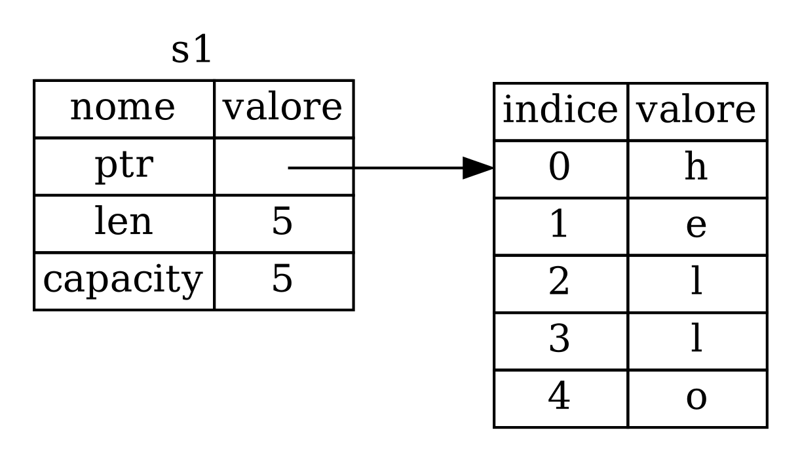
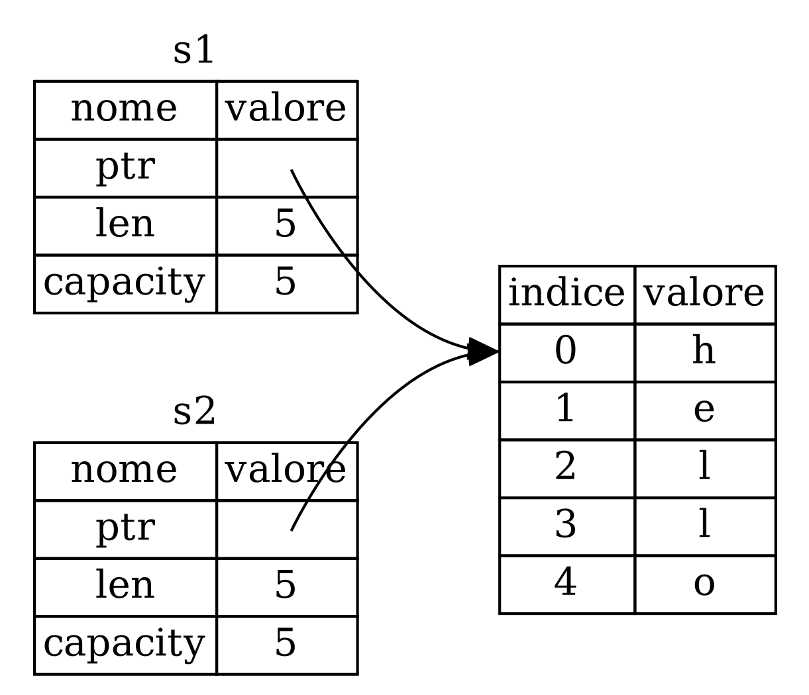
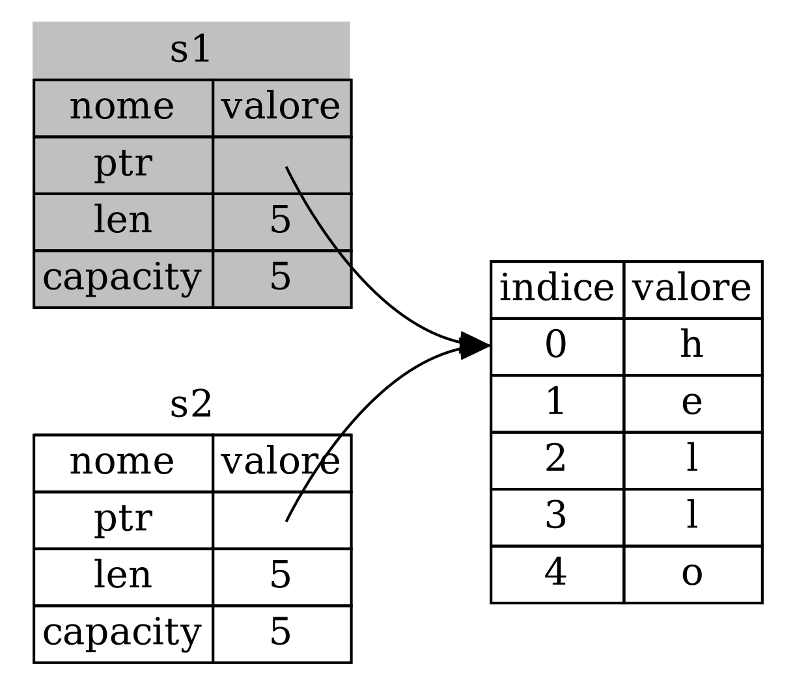
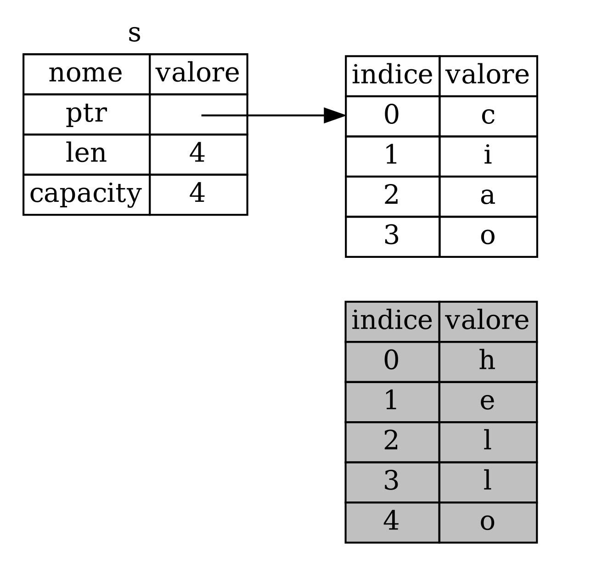

## Cos'è la _Ownership_?

La _ownership_ è un insieme di regole che disciplinano la gestione della memoria
da parte di un programma Rust. Tutti i programmi devono gestire il modo in cui
utilizzano la memoria del computer durante l'esecuzione. Alcuni linguaggi hanno
una _garbage collection_ che cerca regolarmente la memoria non più utilizzata
durante l'esecuzione del programma; in altri linguaggi, il programmatore deve
allocare e rilasciare esplicitamente la memoria. Rust utilizza un terzo
approccio: la memoria viene gestita attraverso un sistema di _controllo
esclusivo_ con un insieme di regole che il compilatore controlla. Se una
qualsiasi delle regole viene violata, il programma non viene compilato. Nessuna
delle caratteristiche di _ownership_ rallenterà il tuo programma mentre è in
esecuzione.

Poiché la _ownership_ è un concetto nuovo per molti programmatori, ci vuole un
po' di tempo per abituarsi. La buona notizia è che più si acquisisce esperienza
con Rust e con le regole del sistema di _ownership_, più sarà facile sviluppare
naturalmente codice sicuro ed efficiente. Non mollare!

Quando capirai la _ownership_, avrai una solida base per comprendere le
caratteristiche che rendono Rust unico. In questo capitolo imparerai la
_ownership_ lavorando su alcuni esempi che si concentrano su una struttura di
dati molto comune: le stringhe.

> ### Lo _Stack_ e l’_Heap_
> Molti linguaggi di programmazione non richiedono di pensare allo _stack_ e
> all’_heap_ molto spesso. Ma in un linguaggio di programmazione di sistema come
> Rust, il fatto che un valore sia sullo _stack_ o nell’_heap_ influisce sul
> comportamento del linguaggio e sul motivo per cui devi prendere determinate
> decisioni.
>
> Sia lo _stack_ che l’_heap_ sono parti di memoria disponibili per il codice da
> utilizzare in fase di esecuzione, ma sono strutturate in modi diversi. Lo
> _stack_ memorizza i valori nell’ordine in cui li ottiene e rimuove i valori
> nell’ordine opposto. Questo viene definito _last in, first out_. Pensa a una
> pila di piatti: quando aggiungi altri piatti, li metti in cima alla pila e
> quando ti serve un piatto, ne togli uno dalla cima. Aggiungere o rimuovere i
> piatti dal centro o dal fondo non funzionerebbe altrettanto bene! L’aggiunta
> di dati sullo _stack_ viene definita _push_ (_immissione_), mentre la
> rimozione dei dati viene definita _pop_ (_estrazione_). Tutti i dati
> archiviati sullo _stack_ devono avere una dimensione nota e fissa. I dati con
> una dimensione sconosciuta in fase di compilazione o una dimensione che
> potrebbe cambiare devono invece essere archiviati nell’_heap_.
>
> L’_heap_ è meno organizzato: quando metti i dati nell’_heap_, richiedi una
> certa quantità di spazio. L’allocatore di memoria trova un punto vuoto
> nell’_heap_ che sia sufficientemente grande, lo contrassegna come in uso e
> restituisce un _puntatore_, che è l’indirizzo di quella posizione. Questo
> processo è chiamato _allocazione nell’heap_ e talvolta è abbreviato
> semplicemente in _allocazione_ (l’inserimento di valori sullo _stack_ non è
> considerato allocazione). Poiché il puntatore all’_heap_ ha una dimensione
> nota e fissa, è possibile archiviare il puntatore sullo _stack_, ma quando si
> desiderano i dati effettivi è necessario seguire il puntatore. Pensa di essere
> seduto in un ristorante. Quando entri, indichi il numero di persone nel tuo
> gruppo e il cameriere trova un tavolo vuoto adatto a tutti e ti conduce lì. Se
> qualcuno nel tuo gruppo arriva in ritardo, può chiedere dove sei seduto e
> trovarti.
>
> Il _push_ sullo _stack_ è più veloce dell’allocazione nell’_heap_ perché
> l’allocatore non deve mai cercare un posto dove archiviare i nuovi dati;
> quella posizione è sempre in cima allo _stack_. In confronto, l’allocazione
> dello spazio nell'_heap_ richiede più lavoro perché l’allocatore deve prima
> trovare uno spazio sufficientemente grande per contenere i dati e quindi
> eseguire la contabilità per prepararsi all’allocazione successiva.
>
> L’accesso ai dati nell’_heap_ è più lento dell’accesso ai dati sullo _stack_
> perché è necessario leggere un puntatore sullo _stack_ per poi "saltare"
> all'indirizzo di memoria nell'_heap_ per accedere ai dati. I processori
> attuali sono più veloci se non "saltano" troppo in giro per la memoria.
> Continuando l’analogia, consideriamo un cameriere in un ristorante che prende
> ordini da molti tavoli. È più efficiente ricevere tutti gli ordini su un
> tavolo prima di passare al tavolo successivo. Prendere un ordine dal tavolo A,
> poi un ordine dal tavolo B, poi ancora uno da A e poi ancora uno da B sarebbe
> un processo molto più lento. Allo stesso modo, un processore può svolgere
> meglio il proprio lavoro se lavora su dati vicini ad altri dati (come sono
> sullo _stack_) piuttosto che più lontani (come possono essere nell’_heap_).
>
> Quando il codice chiama una funzione, i valori passati alla funzione (inclusi,
> potenzialmente, puntatori ai dati nell’_heap_) e le variabili locali della
> funzione vengono inseriti sullo _stack_. Quando la funzione termina, tali
> valori vengono estratti, _pop_, sullo _stack.
>
> Tenere traccia di quali parti del codice utilizzano quali dati nell’_heap_,
> ridurre al minimo la quantità di dati duplicati nell’_heap_ e ripulire i dati
> inutilizzati nell’_heap_ in modo da non esaurire la memoria sono tutti
> problemi che la _ownership_ risolve. Una volta compresa la _ownership_, non
> sarà necessario pensare molto spesso allo _stack_ e all’_heap_, ma comprendere
> che lo scopo principale della _ownership_ è gestire i dati dell’_heap_ può
> aiutare a capire perché funziona in questo modo.

### Regole di _Ownership_

Per prima cosa, diamo un'occhiata alle regole di _ownership_, tenendole a mente
mentre lavoriamo agli esempi che le illustrano:

- Ogni valore in Rust ha un _proprietario_, _owner_.
- Ci può essere un solo _owner_ alla volta.
- Quando l'_owner_ esce dallo _scope_, il valore viene rilasciato.

### _Scope_ delle Variabili

Ora che abbiamo visto e imparato la sintassi di base di Rust, non includeremo
tutto il codice `fn main() {` negli esempi, quindi se stai seguendo, assicurati
di inserire manualmente i seguenti esempi all'interno di una funzione `main`. Di
conseguenza, i nostri esempi saranno un po' più concisi, permettendoci di
concentrarci sui dettagli reali piuttosto che sul codice di base.

Come primo esempio di _ownership_, analizzeremo lo _scope_ di alcune variabili.
Lo _scope_ è l'ambito all'interno di un programma nel quale un elemento è
valido. Prendiamo la seguente variabile:

```rust
let s = "ciao";
```

La variabile `s` si riferisce a un letterale di stringa, il cui valore è
codificato nel testo del nostro programma. La variabile è valida dal momento in
cui viene dichiarata fino alla fine dello _scope_ corrente. Il Listato 4-1
mostra un programma con commenti che annotano i punti in cui la variabile `s`
sarebbe valida (in _scope_).

<Listing number="4-1" caption="Una variabile e lo _scope_ in cui è valida">

```rust
{{#rustdoc_include ../listings/ch04-understanding-ownership/listing-04-01/src/main.rs:here}}
```

</Listing>

In altre parole, ci sono due momenti importanti:

- Quando `s` _entra_ nello _scope_, è valida;
- Rimane valida fino a quando non _esce_ dallo _scope_.

A questo punto, la relazione tra _scope_ e validità delle variabili è simile a
quella di altri linguaggi di programmazione. Ora ci baseremo su questa
comprensione introducendo il _type_ `String`.

### Il _type_ `String`

Per illustrare le regole di _ownership_, abbiamo bisogno di un tipo di dati più
complesso di quelli trattati nel [Capitolo 3][data-types]<!-- ignore -->. I
_type_ trattati in precedenza hanno dimensioni note, possono essere inseriti e
estratti sullo _stack quando il loro _scope_ è terminato, possono essere
rapidamente copiati per creare una nuova istanza indipendente se un’altra parte
del codice deve utilizzare lo stesso valore in uno _scope_ diverso. Ma vogliamo
esaminare i dati archiviati nell’_heap_ ed capire come Rust sa quando ripulire
la memoria che quei dati usavano quando non serve più, e il _type_ `String` è un
ottimo esempio da cui partire.

Ci concentreremo sulle parti di `String` che riguardano la _ownership_. Questi
aspetti si applicano anche ad altri _type_ di dati complessi, siano essi forniti
dalla libreria standard o creati dall’utente. Parleremo di `String` in modo più
approfondito nel [Capitolo 8][ch8]<!-- ignore -->.

Abbiamo già visto i letterali di stringhe, in cui un valore stringa è codificato
nel nostro programma. I letterali di stringhe sono convenienti, ma non sono
adatti a tutte le situazioni in cui potremmo voler utilizzare del testo. Uno dei
motivi è che sono immutabili. Un altro è che non tutti i valori di stringa
possono essere conosciuti quando scriviamo il nostro codice: ad esempio, cosa
succederebbe se volessimo prendere l’input dell’utente e memorizzarlo? Per
queste situazioni, Rust ha un secondo tipo di stringa, `String`. Questo _type_
gestisce i dati allocati nell'_heap_ e come tale è in grado di memorizzare una
quantità di testo a noi sconosciuta in fase di compilazione. Puoi creare un
_type_ `String` partendo da un letterale stringa utilizzando la funzione `from`,
in questo modo:

```rust
let s = String::from("ciao");
```

L'operatore _double colon_ (doppio - due punti) `::` ci permette di integrare
questa particolare funzione `from` nel _type_ `String` piuttosto che usare un
nome come `string_from`. Parleremo di questa sintassi nella sezione ["Sintassi
dei metodi"][method-syntax]<!-- ignore --> del Capitolo 5 e quando parleremo di
come organizzare la nomenclatura nei moduli in ["Percorsi per fare riferimento a
un elemento nell'albero dei moduli"][paths-module-tree]<!-- ignore --> nel
Capitolo 7.

Questo tipo di stringa _può_ essere mutata:

```rust
{{#rustdoc_include ../listings/ch04-understanding-ownership/no-listing-01-can-mutate-string/src/main.rs:here}}
```

Allora, qual è la differenza? Perché `String` può essere mutata ma i letterali
no? La differenza sta nel modo in cui questi due _type_ vengono gestiti in
memoria.

### Memoria e Allocazione

Nel caso di un letterale di stringa, conosciamo il contenuto al momento della
compilazione, quindi il testo è codificato direttamente nell'eseguibile finale.
Per questo motivo i letterali di stringa sono veloci ed efficienti. Ma queste
proprietà derivano solo dall'immutabilità del letterale di stringa.
Sfortunatamente, non possiamo inserire una porzione di memoria indefinita nel
binario per ogni pezzo di testo la cui dimensione è sconosciuta al momento della
compilazione e la cui dimensione potrebbe cambiare durante l'esecuzione del
programma.

Con il _type_ `String`, per supportare una porzione di testo mutabile e
espandibile, dobbiamo allocare una quantità di memoria nell'_heap_, sconosciuta
in fase di compilazione, per contenere il contenuto. Questo significa:
- La memoria deve essere richiesta all’allocatore di memoria in fase di
  esecuzione.
- Abbiamo bisogno di un modo per restituire questa memoria all’allocatore quando
abbiamo finito con la nostra `String`.

La prima parte la facciamo noi: quando chiamiamo `String::from`, la sua
implementazione richiede la memoria di cui ha bisogno. Questo è praticamente
universale nei linguaggi di programmazione.

Tuttavia, la seconda parte è diversa. Nei linguaggi con un _garbage collector_
(GC), il GC tiene traccia e ripulisce la memoria che non viene più utilizzata e
non abbiamo bisogno di pensarci. Nella maggior parte dei linguaggi senza GC, è
nostra responsabilità identificare quando la memoria non viene più utilizzata e
chiamare il codice per liberarla esplicitamente, proprio come abbiamo fatto per
richiederla. Farlo correttamente è stato storicamente un difficile problema di
programmazione. Se ce lo dimentichiamo, sprecheremo memoria. Se lo facciamo
troppo presto, avremo una variabile non valida. Se lo facciamo due volte, anche
questo è un bug. Dobbiamo accoppiare esattamente un’_allocazione_ con
esattamente una _de-allocazione_ (o _rilascio_, _liberazione_).

Rust prende una strada diversa: la memoria viene rilasciata automaticamente una
volta che la variabile che la possiede esce dallo _scope_. Ecco una versione del
nostro esempio sullo _scope_ che utilizza una `String` invece di un letterale
stringa:

```rust
{{#rustdoc_include ../listings/ch04-understanding-ownership/no-listing-02-string-scope/src/main.rs:here}}
```
C’è un punto naturale in cui possiamo rilasciare la memoria di cui la nostra
`String` ha bisogno all’allocatore: quando `s` esce dallo _scope_. Quando una
variabile esce dallo _scope_, Rust chiama per noi una funzione speciale. Questa
funzione si chiama [`drop`][drop]<!-- ignore -->, ed è dove l’autore di `String`
può inserire il codice per rilasciare la memoria. Rust chiama `drop`
automaticamente alla parentesi graffa di chiusura.

> Nota: in C++, questo schema di deallocazione delle risorse alla fine del ciclo
> di vita di un elemento è talvolta chiamato _Resource Acquisition Is
> Initialization (RAII)_. La funzione `drop` di Rust ti sarà familiare se hai
> usato gli schemi RAII.

Questo schema ha un profondo impatto sul modo in cui viene scritto il codice
Rust. Può sembrare semplice in questo momento, ma il comportamento del codice
può essere inaspettato in situazioni più complicate quando vogliamo che più
variabili utilizzino i dati che abbiamo allocato nell’_heap_. Esploriamo ora
alcune di queste situazioni.

<!-- Old heading. Do not remove or links may break. -->
<a id="ways-variables-and-data-interact-move"></a>

#### Interazione tra Variabili e Dati con _Move_

In Rust, più variabili possono interagire con gli stessi dati in modi diversi.
Vediamo un esempio che utilizza un _integer_ nel Listato 4-2.

<Listing number="4-2" caption="Assegnazione del valore integer della variabile `x` a `y`">

```rust
{{#rustdoc_include ../listings/ch04-understanding-ownership/listing-04-02/src/main.rs:here}}
```

</Listing>

Probabilmente possiamo indovinare cosa sta facendo: “associare il valore `5` a
`x`; quindi crea una copia del valore in `x` e associala a `y`.” Ora abbiamo due
variabili, `x` e `y`, ed entrambe uguali a `5`. Questo è effettivamente ciò che
sta accadendo. Poiché gli _integer_ sono valori semplici con una dimensione
fissa e nota, questi due valori `5` vengono immessi sullo _stack_.

Ora diamo un’occhiata alla versione con `String`:

```rust
{{#rustdoc_include ../listings/ch04-understanding-ownership/no-listing-03-string-move/src/main.rs:here}}
```

Sembra molto simile, quindi potremmo pensare che il funzionamento sia lo stesso:
cioè che la seconda riga faccia una copia del valore in `s1` e lo assegni a
`s2`. Ma non è esattamente quello che succede.

Nalla Figura 4-1 diamo un'occhiata _sotto le coperte_ per vedere com'è in realtà
una `String`. Una `String` è composta da tre parti, mostrate a sinistra: un
puntatore (`ptr`) alla memoria che contiene il contenuto della stringa, una
lunghezza (`len`) e una capienza (`capacity`). Questo gruppo di dati è
memorizzato sullo _stack_. A destra c'è la memoria nell'_heap_ che contiene il
contenuto.



<span class="caption">Figura 4-1: Representazione in memoria di una `String` con
valore `"hello"` assegnato a `s1`</span>

La lunghezza è la quantità di memoria, in byte, utilizzata attualmente dal
contenuto della `String`. La capienza è la quantità totale di memoria, in byte,
che `String` ha ricevuto dall’allocatore. La differenza tra lunghezza e capacità
è importante, ma non in questo contesto, quindi per ora va bene ignorare la
capienza.

Quando assegniamo `s1` a `s2`, i dati `String` vengono copiati, ovvero copiamo
il puntatore, la lunghezza e la capienza presenti sullo _stack_. Non copiamo i
dati nell’_heap_ a cui fa riferimento il puntatore. In altre parole, la
rappresentazione dei dati in memoria è simile alla Figura 4-2.



<span class="caption">Figura 4-2: Rappresentazione in memoria della variabile
`s2` che contiene una copia del puntatore, lunghezza e capienza di `s1`</span>

La rappresentazione non assomiglia alla Figura 4-3, che è l'aspetto che avrebbe
la memoria se Rust copiasse anche i dati dell'_heap_. Se Rust facesse così,
l'operazione `s2 = s1` potrebbe diventare molto dispendiosa in termini
prestazionali e di memoria qualora i dati nell'_heap_ fossero di grandi
dimensioni.


<span class="caption">Figura 4-3: Un'altra possibilità di come potrebbe essere
`s2 = s1` se Rust copiasse anche i dati dell'_heap_</span>

In precedenza, abbiamo detto che quando una variabile esce dallo _scope_, Rust
chiama automaticamente la funzione `drop` e ripulisce la memoria nell'_heap_ di
quella variabile. Ma la Figura 4-2 mostra entrambi i puntatori di dati che
puntano alla stessa posizione. Questo è un problema: quando `s2` e `s1` escono
dallo _scope_, entrambe tenteranno di liberare la stessa memoria. Questo è noto
come _errore da doppia de-allocazione_ (_double free error_ in inglese) ed è uno
dei bug di sicurezza della memoria menzionati in precedenza. Rilasciare la
memoria due volte può portare a corruzione di memoria, che può potenzialmente
esporre il programma a vulnerabilità di sicurezza.

Per garantire la sicurezza della memoria, dopo la riga `let s2 = s1;`, Rust
considera `s1` come non più valido. Pertanto, Rust non ha bisogno di liberare
nulla quando `s1` esce dallo _scope_. Controlla cosa succede quando provi a
usare `s1` dopo che `s2` è stato creato: non funzionerà:

```rust,ignore,does_not_compile
{{#rustdoc_include ../listings/ch04-understanding-ownership/no-listing-04-cant-use-after-move/src/main.rs:here}}
```

Otterrai un errore di questo tipo perché Rust ti impedisce di utilizzare il
riferimento invalidato:

```console
{{#include ../listings/ch04-understanding-ownership/no-listing-04-cant-use-after-move/output.txt}}
```

Se hai sentito i termini _copia superficiale_ e _copia profonda_ mentre lavoravi
con altri linguaggi, il concetto di copiare il puntatore, la lunghezza e la
capacità senza copiare i dati probabilmente ti sembrerà simile a una _copia
superficiale_. Ma poiché Rust invalida anche la prima variabile, invece di
essere chiamata _copia superficiale_, questa operazione è nota come _move_
(_spostamento_). In questo esempio, diremmo che `s1` è stata _spostata_ in `s2`.
Quindi, ciò che accade in realtà è mostrato nella Figura 4-4.



<span class="caption">Figura 4-4: Reppresentazione in memoria dopo che `s1` è
resa non valida</span>

Questo risolve il nostro problema! Con la sola `s2` valida, quando essa uscirà
dallo _scope_, solo lei rilascera la memoria e il gioco è fatto.

Inoltre, c’è una scelta progettuale implicita in questo: Rust non creerà mai
automaticamente copie “profonde” dei tuoi dati. Pertanto, si può presupporre che
qualsiasi copia _automatica_ sia poco dispendiosa in termini prestazionali e di
memoria.

#### _Scope_ e Assegnazione

L'opposto di ciò è vero anche per la relazione tra _scope_, _ownership_ e
memoria rilasciata tramite la funzione `drop`. Quando assegni un valore
completamente nuovo a una variabile esistente, Rust chiamerà `drop` e libererà
immediatamente la memoria del valore originale. Considera questo codice, ad
esempio:

```rust
{{#rustdoc_include ../listings/ch04-understanding-ownership/no-listing-04b-replacement-drop/src/main.rs:here}}
```

Inizialmente dichiariamo una variabile `s` e la associamo a una `String` con il
valore `"hello"`. Poi creiamo immediatamente una nuova `String` con il valore
`"ciao"` e la assegniamo a `s`. A questo punto, non c'è più nulla che faccia
riferimento al valore originale nell'_heap_.



<span class="caption">Figura 4-5: Reppresentazione in memoria dopo che il primo
valore è completamente sostituito.</span>

La stringa originale esce così immediatamente dallo _scope_. Rust eseguirà la
funzione `drop` su di essa e la sua memoria verrà rilasciata immediatamente.
Quando stamperemo il valore alla fine, sarà `"ciao, world!"`.

<!-- Old heading. Do not remove or links may break. -->
<a id="ways-variables-and-data-interact-clone"></a>

#### Interazione tra Variabili e Dati con _Clone_

Se vogliamo effettivamente duplicare i dati nell'_heap_ della `String`, e non
solo i dati sullo _stack_, possiamo utilizzare un metodo comune chiamato
`clone`. Parleremo della sintassi dei metodi nel Capitolo 5, ma dato che i
metodi sono una caratteristica comune a molti linguaggi di programmazione,
probabilmente li hai già visti.

Ecco un esempio del metodo `clone` in azione:

```rust
{{#rustdoc_include ../listings/ch04-understanding-ownership/no-listing-05-clone/src/main.rs:here}}
```

Questo funziona benissimo e produce esplicitamente il comportamento mostrato
nella Figura 4-3, in cui i _anche_ i dati dell'_heap_ vengono duplicati.

Quando vedi una chiamata a `clone`, sai che viene eseguito del codice arbitrario
e che questo potrebbe essere dispendioso. È un indicatore visivo del fatto che
sta succedendo qualcosa di diverso.

#### Duplicazione di Dati Sullo _Stack_

C'è un'altra peculiarità di cui non abbiamo ancora parlato: questo codice che
utilizza gli _integer_, in parte mostrato nel Listato 4-2, funziona ed è valido

```rust
{{#rustdoc_include ../listings/ch04-understanding-ownership/no-listing-06-copy/src/main.rs:here}}
```

Ma questo codice sembra contraddire ciò che abbiamo appena imparato: non abbiamo
una chiamata a `clone`, ma `x` è ancora valido e non è stato spostato in `y`.

Il motivo è che i _type_ come gli _integer_ che hanno una dimensione nota in
fase di compilazione vengono archiviati interamente sullo _stack_, quindi le
copie dei valori effettivi sono veloci da creare. Ciò significa che non c’è
motivo per cui vorremmo impedire che `x` sia valido dopo aver creato la
variabile `y`. In altre parole, qui non c’è differenza tra copia profonda e
superficiale, quindi chiamare `clone` non farebbe nulla di diverso dalla solita
copia superficiale e possiamo tralasciarlo.

Rust ha un’annotazione speciale chiamata _tratto_ `Copy` che possiamo
appiccicare sui _type_ memorizzati sullo _stack_, come lo sono gli _integer_
(parleremo meglio dei _tratti_ nel [Capitolo 10][traits]<!-- ignore -->). Se un
_type_ implementa il _tratto_ `Copy`, le variabili che lo utilizzano non si
spostano, ma vengono semplicemente copiate, rendendole ancora valide dopo
l’assegnazione ad un’altra variabile.

Rust non ci permette di annotare un _type_ con `Copy` se il _type_, o una
qualsiasi delle sue parti, ha implementato il _tratto_ `Drop`. Se il _type_ ha
bisogno che accada qualcosa di speciale quando il valore esce dallo _scope_ e
aggiungiamo l'annotazione `Copy` a quel _type_, otterremo un errore in fase di
compilazione. Per sapere come aggiungere l'annotazione `Copy` al tuo _type_,
consulta ["Tratti derivabili"][derivable-traits]<!-- ignore --> nell'Appendice
C.

Quindi, quali _type_ implementano il tratto `Copy`? Puoi controllare la
documentazione del _type_ in questione per esserne sicuro, ma come regola
generale, qualsiasi gruppo di valori scalari semplici può implementare `Copy` e
niente che richieda l'allocazione o che sia una qualche forma di risorsa può
implementare `Copy`:

Ecco alcuni dei _type_ che implementano `Copy`:

- Tutti i _type integer_, come `u32`.
- Il _type_ booleano, `bool`, con i valori `true` e `false`.
- Tutti i _type_ in virgola mobile, come `f64`.
- Il _type_ carattere, `char`.
- Le tuple, se contengono solo _type_ che implementanoe `Copy`. Ad esempio,
  `(i32, i32)` implementa `Copy`, ma `(i32, String)` no.

### _Ownership_ e Funzioni

I meccanismi che regolano il passaggio di un valore a una funzione sono simili a
quelli dell'assegnazione di un valore a una variabile. Passando una variabile a
una funzione, questa viene spostata o copiata, proprio come fa l'assegnazione.
Il Listato 4-3 contiene un esempio con alcune annotazioni che mostrano dove le
variabili entrano ed escono dallo _scope_.

<Listing number="4-3" file-name="src/main.rs" caption="Funzioni con ownership e scope annotate">

```rust
{{#rustdoc_include ../listings/ch04-understanding-ownership/listing-04-03/src/main.rs}}
```

</Listing>

Se provassimo a usare `s` dopo la chiamata a `prende_ownership`, Rust
segnalerebbe un errore in fase di compilazione. Questi controlli statici ci
proteggono dagli errori. Prova ad aggiungere del codice a `main` che usi `s` e
`x` per sperimentare dove puoi usarli e dove le regole di _ownership_ te lo
impediscono.

### Valori di Ritorno e _Scope_

I valori di ritorno possono anch'essi trasferire la _ownership_. Il Listato 4-4
mostra un esempio di funzione che restituisce un valore, con annotazioni simili
a quelle del Listato 4-3.

<Listing number="4-4" file-name="src/main.rs" caption="Transferimento di ownership nei valori di ritorno">

```rust
{{#rustdoc_include ../listings/ch04-understanding-ownership/listing-04-04/src/main.rs}}
```

</Listing>

La _ownership_ di una variabile segue ogni volta lo stesso schema: assegnare un
valore a un’altra variabile la sposta. Quando una variabile che include dati
nell’_heap_ esce dallo _scope_, il valore verrà cancellato da `drop` a meno che
la _ownership_ dei dati non sia stata spostata ad un’altra variabile.

Anche se funziona, prendere e cedere la _ownership_ con ogni funzione è un po’
faticoso. Cosa succede se vogliamo consentire a una funzione di utilizzare un
valore ma non di prenderne la _ownership_? È piuttosto fastidioso che tutto ciò
che passiamo debba anche essere restituito se vogliamo usarlo di nuovo, oltre a
tutte le varie elaborazioni sui dati che la funzione esegue e che magari è
necessario ritornare pure quelle.

Rust ci permette di ritornare più valori utilizzando una _tuple_, come mostrato
nel Listato 4-5

<Listing number="4-5" file-name="src/main.rs" caption="Restituzione ownership dei parametri">

```rust
{{#rustdoc_include ../listings/ch04-understanding-ownership/listing-04-05/src/main.rs}}
```

</Listing>

Ma questa è una procedura inutilmente complessa e richiede molto lavoro per un
concetto che dovrebbe essere comune. Fortunatamente per noi, Rust ha una
funzione che consente di utilizzare un valore senza trasferirne la _ownership_,
chiamata _riferimento_ (_reference_ in inglese).

[data-types]: ch03-02-data-types.html#datatype---tipi-di-dato
[ch8]: ch08-02-strings.html
[traits]: ch10-02-traits.html
[derivable-traits]: appendix-03-derivable-traits.html
[method-syntax]: ch05-03-method-syntax.html#sintassi-dei-metodi
[paths-module-tree]:
    ch07-03-paths-for-referring-to-an-item-in-the-module-tree.html
[drop]: https://doc.rust-lang.org/stable/std/ops/trait.Drop.html#tymethod.drop
