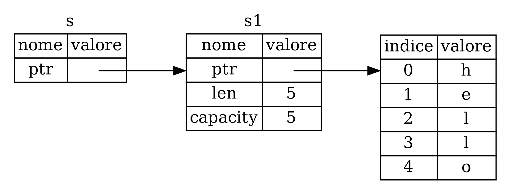

## _Reference_ e _Borrowing_

Il problema con il codice nel Listato 4-5 è che dobbiamo restituire la `String`
alla funzione chiamante in modo da poter ancora utilizzare la `String` dopo la
chiamata a `calcola_lunghezza`, perché la `String` è stata spostata in
`calcola_lunghezza`. Possiamo invece fornire un riferimento (_reference_) al
valore `String`. Un _reference_ è come un puntatore in quanto è un indirizzo che
possiamo seguire per accedere ai dati archiviati a quell’indirizzo di memoria;
la _ownership_ di quei dati appartiene ad un'altra variabile. A differenza di un
puntatore, è garantito che un _reference_ punti a un valore valido di un certo
_type_ finchè il _reference_ è ancora valido.

Ecco come definiresti e utilizzeresti una funzione `calcola_lunghezza` che abbia
un _reference_ ad un oggetto come parametro invece di assumere la _ownership_
del valore:

<Listing file-name="src/main.rs">

```rust
{{#rustdoc_include ../listings/ch04-understanding-ownership/no-listing-07-reference/src/main.rs:all}}
```

</Listing>

Innanzitutto, nota che tutto il codice che dichiarava e ritornava la variabile
tupla è sparito. In secondo luogo, nota che passiamo `&s1` a `calcola_lunghezza`
e, nella sua definizione del parametro, prendiamo `&String` anziché `String`. Il
carattere `&` (_E commerciale_) rappresenta il _reference_ e consente di fare
riferimento a un valore senza prenderne la _ownership_.

La Figura 4-6 illustra questo concetto.



<span class="caption">Figura 4-6: Schema di `&String s` che punta a `String
s1`</span>

> Nota: l'opposto della referenziazione tramite l'uso di `&` è la
> _dereferenziazione_, che si realizza con l'operatore di deferenziazione `*`
> (_deference operator_). Vedremo alcuni usi dell'operatore di dereferenziazione
> nel Capitolo 8 e discuteremo i dettagli della dereferenziazione nel Capitolo
> 15.

Diamo un'occhiata più da vicino alla chiamata di funzione:

```rust
{{#rustdoc_include ../listings/ch04-understanding-ownership/no-listing-07-reference/src/main.rs:here}}
```

La sintassi `&s1` ci permette di creare un _reference_ che punta al valore di
`s1` ma non lo _possiede_. Poiché il _reference_ non lo _possiede_, il valore a
cui punta non verrà rilasciato dalla memoria quando il _reference_ smette di
essere utilizzato. Allo stesso modo, la firma della funzione utilizza `&` per
indicare che il _type_ del parametro `s` è un _reference_. Aggiungiamo alcune
annotazioni esplicative:

```rust
{{#rustdoc_include ../listings/ch04-understanding-ownership/no-listing-08-reference-with-annotations/src/main.rs:here}}
```

Lo _scope_ in cui la variabile `s` è valida è lo stesso dello _scope_ di
qualsiasi parametro di funzione, ma il valore a cui punta il _referecence_ non
viene eliminato quando `s` smette di essere utilizzato, perché `s` non ha la
_ownership_. Quando le funzioni hanno _reference_ come parametri anziché valori
effettivi, non avremo bisogno di restituire i valori per restituire la
_ownership_, perché la _ownership_ non ci è mai stata trasferita.

L'azione di creare un _reference_ viene chiamata _borrowing_ (_fare un prestito_
in italiano). Come nella vita reale, se una persona possiede qualcosa, puoi
chiedergliela in prestito. Quando hai finito, devi restituirla. Non la possiedi.

Quindi, cosa succede se proviamo a modificare qualcosa che abbiamo in prestito?
Prova il codice nel Listato 4-6. Avviso spoiler: non funziona!

<Listing number="4-6" file-name="src/main.rs" caption="Tentativo di modifica di un valore in prestito">

```rust,ignore,does_not_compile
{{#rustdoc_include ../listings/ch04-understanding-ownership/listing-04-06/src/main.rs}}
```

</Listing>

Ecco l'errore:

```console
{{#include ../listings/ch04-understanding-ownership/listing-04-06/output.txt}}
```
Così come le variabili sono immutabili come impostazione predefinita, lo sono
anche i _reference_. Non possiamo modificare qualcosa a cui abbiamo solo un
riferimento.

### _Reference_ Mutabili

Possiamo correggere il codice del Listato 4-6 per permetterci di modificare un
valore preso in prestito con alcune piccole modifiche che utilizzano, invece, un
_reference mutabile_:

<Listing file-name="src/main.rs">

```rust
{{#rustdoc_include ../listings/ch04-understanding-ownership/no-listing-09-fixes-listing-04-06/src/main.rs}}
```

</Listing>

Per prima cosa rendiamo `s` mutabile con `mut`. Poi creiamo un _reference_
mutabile con `&mut s` dove chiamiamo la funzione `cambia` e aggiorniamo la firma
della funzione in modo che accetti un _reference_ mutabile con `una_stringa:
&mut String`. In questo modo è molto chiaro che la funzione `cambia` muterà il
valore che prende in prestito. I _reference_ mutabili hanno una grande
restrizione: se hai un _reference_ mutabile a un valore, non puoi avere altri
_reference_ a quel valore. Questo codice che tenta di creare due _reference_
mutabili a `s` fallirà:

<Listing file-name="src/main.rs">

```rust,ignore,does_not_compile
{{#rustdoc_include ../listings/ch04-understanding-ownership/no-listing-10-multiple-mut-not-allowed/src/main.rs:here}}
```

</Listing>

Ecco l'errore:

```console
{{#include ../listings/ch04-understanding-ownership/no-listing-10-multiple-mut-not-allowed/output.txt}}
```

L'errore dice che questo codice non è valido perché non possiamo avere più di un
_reference_ mutabile alla volta ad `s`. Il primo _reference_ mutabile è in `r1`
e deve durare fino a quando non viene utilizzato nel `println!`, ma tra la
creazione di quel _reference_ mutabile e il suo utilizzo, abbiamo cercato di
creare un altro _referene_ mutabile in `r2` che prende in prestito gli stessi
dati di `r1`.

La restrizione che impedisce più _reference_ mutabili agli stessi dati
contemporaneamente consente la mutazione ma in modo molto controllato. È
qualcosa con cui chi comincia a programmare in Rust fatica perché la maggior
parte dei linguaggi ti consente di mutare quando vuoi. Il vantaggio di avere
questa restrizione è che Rust può prevenire conflitti di accesso ai dati, _data
race_, in fase di compilazione. Una _data race_ è simile a una condizione di
competizione e si verifica quando si verificano questi tre comportamenti:

- Due o più puntatori accedono contemporaneamente agli stessi dati.
- Almeno uno dei puntatori viene utilizzato per scrivere nei dati.
- Non viene utilizzato alcun meccanismo per sincronizzare l’accesso ai dati

I _data race_ causano comportamenti non programmati e possono essere difficili
da diagnosticare e risolvere quando si cerca di individuarli in _runtime_; Rust
previene questo problema rifiutando di compilare codice contenente _data race_!

Come sempre, possiamo usare le parentesi graffe per creare uno _scope_ nuovo,
consentendo di avere più _reference_ mutabili, ma non _simultanee_:

```rust
{{#rustdoc_include ../listings/ch04-understanding-ownership/no-listing-11-muts-in-separate-scopes/src/main.rs:here}}
```

Rust applica una regola simile per combinare _reference_ mutabili e immutabili.
Questo codice genera un errore:

```rust,ignore,does_not_compile
{{#rustdoc_include ../listings/ch04-understanding-ownership/no-listing-12-immutable-and-mutable-not-allowed/src/main.rs:here}}
```

Ecco l'errore:

```console
{{#include ../listings/ch04-understanding-ownership/no-listing-12-immutable-and-mutable-not-allowed/output.txt}}
```

Wow! Non possiamo nemmeno avere un _reference_ mutabile mentre ne abbiamo uno
immutabile allo stesso valore.

Chi userà un _reference_ immutabile non si aspetta certo che il valore cambi
improvvisamente! Tuttavia, sono consentiti _reference_ multipli immutabili
perché nessuno che stia leggendo i dati ha la possibilità di influenzare la
lettura dei dati da parte di altri.

Nota che lo _scope_ di un _reference_ inizia dal punto in cui viene introdotto e
continua fino all'ultima volta che viene utilizzato. Ad esempio, questo codice
verrà compilato perché l'ultimo utilizzo dei _reference_ immutabili avviene nel
`println!`, prima che venga introdotto il _reference_ mutabile:

```rust
{{#rustdoc_include ../listings/ch04-understanding-ownership/no-listing-13-reference-scope-ends/src/main.rs:here}}
```

Gli _scope_ dei _reference_ immutabili `r1` e `r2` terminano dopo il `println!`
in cui sono stati utilizzati per l'ultima volta, ovvero prima che venga creato
il _reference_ mutabile `r3`. Questi _scope_ non si sovrappongono, quindi questo
codice è consentito: il compilatore capisce che il _reference_ non verrà più
utilizzato in nessun altro punto prima della fine dello _scope_.

Anche se a volte gli errori  di _borrowing_ possono essere frustranti, ricorda
che è il compilatore di Rust a segnalare un potenziale bug in anticipo (in fase
di compilazione e non in fase di esecuzione) e a mostrarti esattamente dove si
trova il problema. In questo modo non dovrai cercare di capire perché i tuoi
dati non sono quelli che pensavi fossero quando il programma è in esecuzione.

### _Reference_ Pendenti

Nei linguaggi con puntatori, è facile creare erroneamente un _puntatore
pendente_, cioé un puntatore che fa riferimento a una posizione in memoria non
più valido, perché quella momoria assegnata a quella variabile è stata liberata,
ma non si è provveduto a cancellare anche il puntatore che per l'appunto rimane
_pendente_ puntando a qualcosa che non è più disponibile. In Rust, al contrario,
il compilatore garantisce che i _reference_ non diverranno mai _pendenti_: se si
ha un _reference_ ad alcuni dati, il compilatore si assicurerà che i dati non
escano dallo _scope_ prima che lo faccia il _reference_ a quei dati.

Proviamo a creare un _reference_ _pendente_ per vedere come Rust li previene
segnalando un errore in fase di compilazione:

<Listing file-name="src/main.rs">

```rust,ignore,does_not_compile
{{#rustdoc_include ../listings/ch04-understanding-ownership/no-listing-14-dangling-reference/src/main.rs}}
```

</Listing>

Ecco l'errore:

```console
{{#include ../listings/ch04-understanding-ownership/no-listing-14-dangling-reference/output.txt}}
```
Questo messaggio di errore si riferisce a una funzionalità che non abbiamo
ancora trattato: la longevità (_lifetime_ d'ora in poi). Parleremo in dettaglio
della _lifetime_ nel Capitolo 10. Ma, se trascuriamo le parti relative alla
_lifetime_, il messaggio contiene la chiave del motivo per cui questo codice è
un problema:

```text
this function's return type contains a borrowed value, but there is no value
for it to be borrowed from

(traduzione: il type di ritorno di questa funzione contiene un valore in prestito,
ma non c'è alcun valore da cui prenderlo in prestito)
```

Diamo un'occhiata più da vicino a cosa succede esattamente in ogni fase della
nostra funzione `pendente`:

<Listing file-name="src/main.rs">

```rust,ignore,does_not_compile
{{#rustdoc_include ../listings/ch04-understanding-ownership/no-listing-15-dangling-reference-annotated/src/main.rs:here}}
```

</Listing>

Poiché `s` viene creato all'interno di `pendente`, quando il codice di
`pendente` sarà terminato, `s` e la memoria ad essa assegnata verranno
rilasciate. Ma abbiamo cercato di restituire un _reference_ a questa memoria.
Ciò significa che questo _reference_ punterebbe a una `String` non valida.
Questo non va bene! Rust non ci permette di farlo.

La soluzione è restituire direttamente la `String`:

```rust
{{#rustdoc_include ../listings/ch04-understanding-ownership/no-listing-16-no-dangle/src/main.rs:here}}
```

Questo funziona senza problemi: la _ownership_ viene spostata all'esterno e non
viene rialssciato nulla.

### Le Regole dei _Reference_

Ricapitoliamo quello che abbiamo detto sui _reference_:

- In un dato momento, puoi avere o un singolo _reference_ mutabile o un numero
qualsiasi di _reference_ immutabili.
- I _reference_ devono essere sempre validi.

Successivamente, analizzeremo un altra tipologia di _reference_: le _sezioni_
(_slice_ in inglese).
