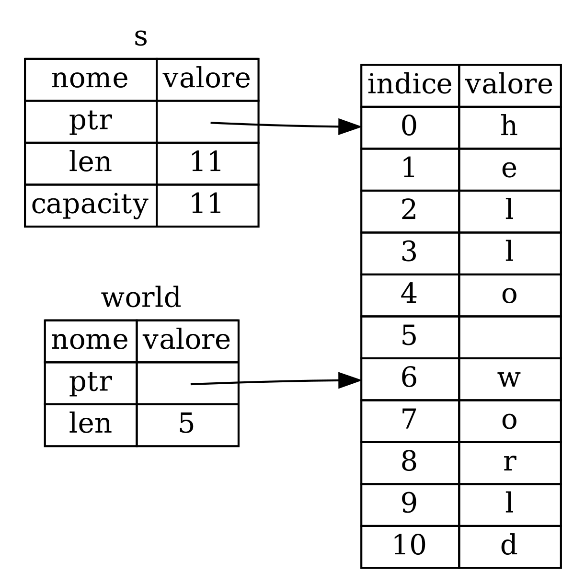

## Il _Type_ _Slice_

Le _slice_ (_sezioni_, _fette_, _porzioni_ in italiano) ti permettono di fare
riferimento (un _reference_) a una sequenza contigua di elementi in una
[collezione](ch08-00-common-collections.md). Una _slice_ è una tipologia di
_reference_, quindi non ha _ownership_.

Ecco un piccolo problema di programmazione: scrivi una funzione che prenda una
stringa di parole separate da spazi e restituisca la prima parola che trova in
quella stringa. Se la funzione non trova uno spazio nella stringa, l'intera
stringa deve essere considerata come una sola parola, quindi deve essere
restituita l'intera stringa.

> Nota: Ai fini dell'introduzione alle _slice_ di stringhe, stiamo assumendo
> solo caratteri ASCII in questa sezione; una discussione più approfondita sulla
> gestione di UTF-8 si trova nella sezione [“Memorizzazione del testo codificato
> UTF-8 con le stringhe”][strings] del Capitolo 8.

Lavoriamo su come scrivere la firma di questa funzione senza usare _slice_ per
ora, per comprendere il problema che le _slice_ risolveranno:

```rust,ignore
fn prima_parola(s: &String) -> ?
```

La funzione `prima_parola` ha un parametro di tipo `&String`. Non abbiamo
bisogno di _ownership_, quindi va bene. (In Rust idiomatico, le funzioni non
prendono la _ownership_ dei loro argomenti se non strettamente necessario, e i
motivi per questo diventeranno chiari man mano che andremo avanti.) Ma cosa
dovremmo ritornare? Non abbiamo davvero un modo per descrivere una *parte* di
una stringa. Tuttavia, potremmo restituire l'indice della fine della parola,
indicato da uno spazio. Proviamo a farlo, come mostrato nel Listato 4-7.

<Listing number="4-7" file-name="src/main.rs" caption="La funzione `prima_parola` che restituisce un valore di indice byte nella variabile `String`">

```rust
{{#rustdoc_include ../listings/ch04-understanding-ownership/listing-04-07/src/main.rs:here}}
```

</Listing>

Poiché dobbiamo esaminare la `String` elemento per elemento e controllare se un
valore è uno spazio, convertiremo la nostra `String` in un array di byte usando
il metodo `as_bytes`.

```rust,ignore
{{#rustdoc_include ../listings/ch04-understanding-ownership/listing-04-07/src/main.rs:as_bytes}}
```

Successivamente, creiamo un iteratore sull'array di byte usando il metodo
`iter`:

```rust,ignore
{{#rustdoc_include ../listings/ch04-understanding-ownership/listing-04-07/src/main.rs:iter}}
```

Discuteremo gli iteratori in modo più dettagliato nel [Capitolo 13][ch13]<!--
ignore -->. Per ora, sappi che `iter` è un metodo che restituisce ogni elemento
in una collezione e che `enumerate` prende il risultato di `iter` e restituisce
ogni elemento come parte di una _tuple_. Il primo elemento della _tuple_
restituita da `enumerate` è l'indice, e il secondo elemento è un riferimento
all'elemento. Questo è un po' più conveniente rispetto a calcolarci l'indice da
soli.

Poiché il metodo `enumerate` restituisce una _tuple_, possiamo usare i _pattern_
per destrutturare quella _tuple_. Discuteremo meglio i _pattern_ nel [Capitolo
6][ch6]. Nel ciclo `for`, specifichiamo un _pattern_ che ha `i` per l'indice
nella _tuple_ e `&item` per il singolo byte nella _tuple_. Poiché da
`.iter().enumerate()` otteniamo un _rererence_ all'elemento, usiamo `&` nel
_pattern_.

All'interno del ciclo `for`, cerchiamo il byte che rappresenta lo spazio usando
la sintassi letterale del byte. Se troviamo uno spazio, restituiamo la
posizione. Altrimenti, restituiamo la lunghezza della stringa usando `s.len()`.

```rust,ignore
{{#rustdoc_include ../listings/ch04-understanding-ownership/listing-04-07/src/main.rs:inside_for}}
```

Ora abbiamo un metodo per scoprire l'indice della fine della prima parola nella
stringa, ma c'è un problema. Stiamo ritornando un `usize` da solo, che è un
numero significativo solo se usato in contesto con `&String`. In altre parole,
poiché è un valore separato dalla `String`, non c'è garanzia che rimarrà valido
in futuro. Considera il programma nel Listing 4-8 che utilizza la funzione
`prima_parola` dal Listing 4-7.

<Listing number="4-8" file-name="src/main.rs" caption="Memorizzare il risultato della chiamata alla funzione `prima_parola` e poi modificare il contenuto della `String`">

```rust
{{#rustdoc_include ../listings/ch04-understanding-ownership/listing-04-08/src/main.rs:here}}
```

</Listing>

Questo programma si compila senza errori e lo farebbe anche se usassimo `parola`
dopo aver chiamato `s.clear()`. Poiché `parola` non è collegato allo stato di
`s`, `parola` contiene ancora il valore `5`. Potremmo usare quel valore `5` con
la variabile `s` per cercare di estrarre la prima parola, ma questo sarebbe un
bug perché il contenuto di `s` è cambiato da quando abbiamo salvato `5` in
`parola`.

Doversi preoccupare dell'indice in `parola` che si disallinea con i dati in `s`
è noioso e soggetto a errori! Gestire questi indici è ancora più fragile se
scriviamo una funzione `seconda_parola`. La sua firma dovrebbe apparire così:

```rust,ignore
fn seconda_parola(s: &String) -> (usize, usize) {
```

Ora stiamo tracciando un indice di partenza _e_ un indice di fine, e abbiamo
ancora altri valori che sono stati calcolati da dati in un determinato stato, ma
che non sono per nulla _legati_ a quello stato in qualche modo. Abbiamo tre
variabili non correlate e indipendenti che noi dobbiamo mantenere in sincronia.

Fortunatamente, Rust ha una soluzione a questo problema: le _slice_ di stringhe.

### String _Slice_

Una _string slice_ è un _reference_ a una sequenza contigua degli elementi di
una `String`, e appare così:

```rust
{{#rustdoc_include ../listings/ch04-understanding-ownership/no-listing-17-slice/src/main.rs:here}}
```

Invece di un _reference_ all'intera `String`, `hello` è un _reference_ a una
porzione della `String`, specificata con l'aggiunta di `[0..5]`. Creiamo le
_slice_ usando un intervallo all'interno delle parentesi quadre specificando
`[indice_inizio..indice_fine]`, dove _`indice_inizio`_ è la prima posizione
nella _slice_ e _`indice_fine`_ è l'ultima posizione nella _slice_ più uno.
Internamente, la struttura dati della _slice_ memorizza la posizione iniziale e
la lunghezza della _slice_, che corrisponde a _`indice_fine`_ meno
_`indice_inizio`_. Quindi, nel caso di `let world = &s[6..11];`, `world` sarebbe
una _slice_ che contiene un puntatore al byte all'indice 6 di `w` con un valore
di lunghezza di `5`.

La Figura 4-7 mostra questo in un diagramma.



<span class="caption">Figura 4-7: String _slice_ che si riferisce a parte di una `String`</span>

Con la sintassi d'intervallo `..` di Rust, se vuoi iniziare dall'indice 0, puoi
omettere il valore prima dei due punti. In altre parole, questi sono
equivalenti:

```rust
let s = String::from("hello");

let slice = &s[0..2];
let slice = &s[..2];
```

Allo stesso modo, se la tua _slice_ include l'ultimo byte della `String`, puoi
omettere il numero finale. Ciò significa che questi sono equivalenti:

```rust
let s = String::from("hello");

let len = s.len();

let slice = &s[3..len];
let slice = &s[3..];
```

Puoi anche omettere entrambi i valori per prendere una _slice_ dell'intera
stringa. Quindi questi sono equivalenti:

```rust
let s = String::from("hello");

let len = s.len();

let slice = &s[0..len];
let slice = &s[..];
```

> Nota: Gli indici di intervallo delle _slice_ di stringa devono trovarsi in
> posizioni valide tenendo conto anche dei caratteri UTF-8. Se tenti di creare
> una _slice_ nel mezzo di un carattere multibyte, il tuo programma terminerà
> con un errore.

Tenendo presente tutte queste informazioni, riscriviamo `prima_parola` per
restituire una _slice_. Il _type_ che indica la _slice_ di stringa è scritto
come `&str`:

<Listing file-name="src/main.rs">

```rust
{{#rustdoc_include ../listings/ch04-understanding-ownership/no-listing-18-first-word-slice/src/main.rs:here}}
```

</Listing>

Otteniamo l'indice per la fine della parola nello stesso modo in cui lo abbiamo
fatto nel Listato 4-7, cercando la prima occorrenza di uno spazio. Quando
troviamo uno spazio, restituiamo una _slice_ di stringa usando l'inizio della
stringa e l'indice dello spazio come indici di inizio e fine.

Ora, quando chiamiamo `prima_parola`, otteniamo un singolo valore che è legato
ai dati sottostanti. Il valore è composto da un _reference_ al punto di partenza
della _slice_ e dal numero di elementi nella _slice_.

Restituire una _slice_ funzionerebbe anche per una funzione `seconda_parola`:

```rust,ignore
fn seconda_parola(s: &String) -> &str {
```

Ora abbiamo una funzione più semplice in cui è molto più difficile succedano
cose strane perché il compilatore garantirà che i _reference_ alla `String`
rimangano validi. Ricordi il bug nel programma nel Listato 4-8, quando abbiamo
ottenuto l'indice per la fine della prima parola ma poi abbiamo svuotato la
stringa, rendendo il nostro indice non valido? Quel codice era logicamente
errato ma non mostrava immediatamente errori. I problemi si sarebbero
manifestati più tardi se avessimo continuato a cercare di usare l'indice della
prima parola con una stringa svuotata. Le _slice_ rendono questo bug impossibile
e ci fanno sapere che abbiamo un problema con il nostro codice molto prima.
Usare la versione _slice_ di `prima_parola` genererà un errore di compilazione:

<Listing file-name="src/main.rs">

```rust,ignore,does_not_compile
{{#rustdoc_include ../listings/ch04-understanding-ownership/no-listing-19-slice-error/src/main.rs:here}}
```

</Listing>

Ecco l'errore del compilatore:

```console
{{#include ../listings/ch04-understanding-ownership/no-listing-19-slice-error/output.txt}}
```

Ricorda le regole di _borrowing_: se abbiamo un _reference_ immutabile a
qualcosa, non possiamo anche prendere un _reference_ mutabile. Poiché `clear`
deve troncare la `String`, ha bisogno di ottenere un _reference_ mutabile. Il
`println!` dopo la chiamata a `clear` utilizza il _reference_ a `parola`, quindi
il _reference_ immutabile deve essere ancora attivo a quel punto. Rust vieta che
il _reference_ mutabile in `clear` e il _reference_ immutabile a `parola`
esistano contemporaneamente, e la compilazione fallisce. Non solo Rust ha reso
la nostra funzione più facile da usare, ma ha anche eliminato un'intera classe
di errori durante la compilazione!

<!-- Old heading. Do not remove or links may break. -->
<a id="string-literals-are-slices"></a>

### Letterali di stringa come _Slice_

Ricordi che abbiamo parlato dei letterali di stringhe memorizzati all'interno
del binario? Ora che abbiamo scoperto le _slice_, possiamo comprendere
correttamente i letterali di stringhe:

```rust
let s = "Hello, world!";
```

Il _type_ di `s` qui è `&str`: è una _slice_ che punta a quel punto specifico
nel binario. Questo è anche il motivo per cui i letterali di stringhe sono
immutabili; `&str` è un _reference_ immutabile.

### String _Slice_ come Parametri

Sapendo che puoi avere _slice_ di litterali e di valori `String`, arriviamo a un
ulteriore miglioramento per `prima_parola`, e cioè la sua firma:

```rust,ignore
fn prima_parola(s: &String) -> &str {
```

Un Rustacean più esperto scriverebbe invece la firma come mostrata nel Listato
4-9, perché ci permette di usare la stessa funzione sia su valori `&String` che
su valori `&str`.

<Listing number="4-9" caption="Migliorare la funzione `prima_parola` utilizzando una string slice come type del parametro `s`">

```rust,ignore
{{#rustdoc_include ../listings/ch04-understanding-ownership/listing-04-09/src/main.rs:here}}
```

</Listing>

Se abbiamo una string _slice_, possiamo passarlo direttamente. Se abbiamo una
`String`, possiamo passare una _slice_ della `String` o un _reference_ alla
`String`. Questa flessibilità sfrutta la _deref coercions_ (_de-referenziazione
forzata_), una funzionalità che tratteremo nella sezione [“De-referenziazione
forzata implicita in Funzioni e Metodi”][deref-coercions] del Capitolo 15.

Definire una funzione che come parametro prende una string _slice_ invece di un
_reference_ a una `String` rende la nostra funzione più generica e utile senza
perdere alcuna funzionalità:

<Listing file-name="src/main.rs">

```rust
{{#rustdoc_include ../listings/ch04-understanding-ownership/listing-04-09/src/main.rs:usage}}
```

</Listing>

### Altri _Slice_

Le string _slice_, come puoi immaginare, sono specifici per le stringhe. Ma c'è
anche un tipo di _slice_ più generale. Considera questo array:

```rust
let a = [1, 2, 3, 4, 5];
```

Proprio come potremmo voler fare _reference_ a parte di una stringa, potremmo
voler fare _reference_ a parte di un array. Lo faremmo in questo modo:

```rust
let a = [1, 2, 3, 4, 5];

let slice = &a[1..3];

assert_eq!(slice, &[2, 3]);
```

Questa _slice_ ha il _type_ `&[i32]`. Funziona allo stesso modo delle string
_slice_, memorizzando un _reference_ al primo elemento e una lunghezza.
Utilizzerai questo tipo di _slice_ per tutti i _type_ di altre collezioni.
Discuteremo di queste collezioni in dettaglio quando parleremo dei vettori nel
Capitolo 8.

## Riepilogo

I concetti di _ownership_, _borrowing_ e _slice_ garantiscono la sicurezza della
memoria nei programmi Rust già in fase d compilazione. Il linguaggio Rust ti
offre il controllo sul tuo utilizzo della memoria nello stesso modo in cui fanno
altri linguaggi di programmazione di sistema, ma avere un _proprietario_
(_ownership_) per ogni dato e che questo _pulisca_ automaticamente i propri dati
quando se ne va (non più in _scope_), significa non dover scrivere e debuggare
codice extra per ottenere questo controllo.

L'_ownership_ influisce su come molte altre parti di Rust funzionano, quindi
parleremo di questi concetti ulteriormente nel resto del libro. Passiamo al
Capitolo 5 e vediamo come raggruppare pezzi di dati insieme in una `struct`.

[ch13]: ch13-02-iterators.html
[ch6]: ch06-02-match.html#pattern-che-si-legano-ai-valori
[strings]: ch08-02-strings.html#memorizzazione-di-testo-codificato-utf-8-con-stringhe
[deref-coercions]: ch15-02-deref.html#de-referenziazione-forzata-implicita-in-funzioni-e-metodi