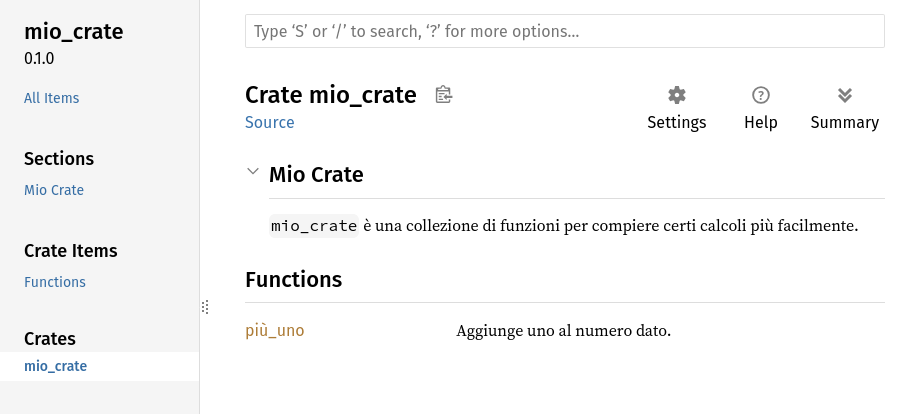

## Pubblicare un _Crate_ su Crates.io

Abbiamo utilizzato i pacchetti di [crates.io](https://crates.io/)<!-- ignore -->
come dipendenze del nostro progetto, ma puoi anche condividere il tuo codice con
altre persone pubblicando i tuoi pacchetti. Il registro dei _crate_ di
[crates.io](https://crates.io/)<!-- ignore --> distribuisce il codice sorgente
dei tuoi pacchetti, quindi ospita principalmente codice _open source_.

Rust e Cargo hanno delle funzioni che rendono il tuo pacchetto pubblicato più
facile da trovare e da usare. Parleremo di alcune di queste funzioni e poi
spiegheremo come pubblicare un pacchetto.

> *Nota di traduzione: Quando si realizza documentazione è buona pratica che sia
> scritta in un linguaggio internazionale come l’inglese. In questo capitolo si
> è deciso di tradurre anche la documentazione del codice in italiano per
> facilitare la comprensione, ma se vorrai pubblicare codice e la relativa
> documentazione è consigliabile farlo in inglese.*

### Commentare il Codice a Fini di Documentazione

Documentare accuratamente i tuoi pacchetti aiuterà gli altri utenti a sapere
come e quando usarli, quindi vale la pena investire del tempo per scrivere la
documentazione. Nel Capitolo 3 abbiamo parlato di come commentare il codice di
Rust usando due barre, `//`. Rust ha anche un particolare tipo di commento per
la documentazione, noto come _commento di documentazione_, che genererà la
documentazione HTML. L’HTML mostra il contenuto dei commenti di documentazione
per gli elementi API pubblici destinati ai programmatori interessati a sapere
come _usare_ il tuo _crate_ piuttosto che come il tuo _crate_ è _implementato_.

I commenti di documentazione utilizzano tre barre, `///`, invece di due e
supportano la notazione Markdown per la formattazione del testo. Posiziona i
commenti di documentazione subito prima dell’elemento che stanno documentando.
Il Listato 14-1 mostra i commenti di documentazione per una funzione `più_uno`
in un _crate_ chiamato `mio_crate`

<Listing number="14-1" file-name="src/lib.rs" caption="Un commento di documentazione per una funzione">

```rust,ignore
{{#rustdoc_include ../listings/ch14-more-about-cargo/listing-14-01/src/lib.rs}}
```

</Listing>

Qui diamo una descrizione di cosa fa la funzione `più_uno`, iniziamo una sezione
con l’intestazione `Esempi` (_Examples_) e poi forniamo del codice che dimostra
come utilizzare la funzione `più_uno`. Possiamo generare la documentazione HTML
da questo commento di documentazione eseguendo `cargo doc`. Questo comando
esegue lo strumento `rustdoc` distribuito con Rust e mette la documentazione
HTML generata nella cartella _target/doc_.

Per comodità, eseguendo `cargo doc --open` si costruisce l’HTML della
documentazione del tuo _crate_ attuale (così come la documentazione di tutte le
dipendenze del tuo _crate_) e si apre il risultato in un browser web. Naviga
alla funzione `più_uno` per vedere che il testo nei commenti di documentazione
apparirà come mostrato nella Figura 14-1.

<figure>


<figcaption>Figura 14-1: La documentazione HTML per la funzione
`più_uno`</figcaption>

<figure>

#### Sezioni Comunemente Utilizzate

Abbiamo usato l’intestazione Markdown `# Esempi` nel Listato 14-1 per creare una
sezione nell’HTML con il titolo “Esempi”. Ecco altre sezioni che gli autori di
_crate_ utilizzano comunemente nella loro documentazione:

- **Panic** (_Panics_): Questi sono gli scenari in cui la funzione documentata
  potrebbe andare in _panic_. I chiamanti della funzione che non vogliono che i
  loro programmi vadano in _panic_ devono assicurarsi di non chiamare la
  funzione in queste situazioni.
- **Errori** (_Errors_): Se la funzione restituisce un `Result`, descrivere la
  tipologia di errori che potrebbero verificarsi e quali condizioni potrebbero
  causare la restituzione di tali errori può essere utile ai chiamanti, in modo
  che possano scrivere codice per gestire i diversi tipi di errore in modi
  diversi.
- **Sicurezza** (_Safety_): Se la funzione è `unsafe` (ne parliamo nel Capitolo
  20), deve essere presente una sezione che spieghi perché la funzione non è
  sicura e che descriva gli invarianti che la funzione si aspetta che i
  chiamanti rispettino.

La maggior parte dei commenti di documentazione non ha bisogno di tutte queste
sezioni, ma questa è una buona lista da controllare per ricordarti gli aspetti
del tuo codice che gli utenti saranno interessati a conoscere.

#### Commenti di Documentazione Come Test

L’aggiunta di blocchi di codice di esempio nei commenti di documentazione può
aiutare a dimostrare l’uso della libreria e ha un ulteriore vantaggio:
l’esecuzione di `cargo test` eseguirà gli esempi di codice nella documentazione
come test! Non c’è niente di meglio di una documentazione con esempi, ma non c’è
niente di peggio di esempi che non funzionano perché il codice è cambiato da
quando è stata scritta la documentazione. Se eseguiamo `cargo test` con la
documentazione della funzione `più_uno` del Listato 14-1, vedremo una sezione
nei risultati del test che assomiglia a questa:

<!-- manual-regeneration
cd listings/ch14-more-about-cargo/listing-14-01/
cargo test
copy just the doc-tests section below
-->

```console
   Doc-tests mio_crate

running 1 test
test src/lib.rs - più_uno (line 5) ... ok

test result: ok. 1 passed; 0 failed; 0 ignored; 0 measured; 0 filtered out; finished in 0.27s
```

Ora, se modifichiamo la funzione o l’esempio in modo che `assert_eq!`
nell’esempio vada in _panic_, ed eseguiamo di nuovo `cargo test`, vedrai che i
_Doc-tests_ rileveranno che l’esempio e il codice non sono compatibili tra loro!

#### Commentare l’Elemento Contenitore

Lo stile dei commenti di documentazione `//!` aggiunge la documentazione
all’elemento che *contiene* i commenti piuttosto che agli elementi che *seguono*
i commenti. Di solito usiamo questi commenti di documentazione all’interno del
file radice del _crate_ (_src/lib.rs_ per convenzione) o all’interno di un
modulo per documentare il _crate_ o il modulo nel suo complesso.

Ad esempio, per aggiungere la documentazione che descrive lo scopo del _crate_
`mio_crate` che contiene la funzione `più_uno`, aggiungiamo i commenti di
documentazione che iniziano con `//!` all’inizio del file _src/lib.rs_, come
mostrato nel Listato 14-2.

<Listing number="14-2" file-name="src/lib.rs" caption="La documentazione generale per l’intero _crate_ `mio_crate`">

```rust,ignore
{{#rustdoc_include ../listings/ch14-more-about-cargo/listing-14-02/src/lib.rs:here}}
```

</Listing>

Nota che non c’è codice dopo l’ultima riga che inizia con `//!`. Poiché abbiamo
iniziato i commenti con `//!` invece che con `//`, stiamo documentando
l’elemento che contiene questo commento piuttosto che un elemento che segue
questo commento. In questo caso, questo elemento è il file _src/lib.rs_ stesso,
che è la radice del _crate_. Questi commenti descrivono quindi l’intero _crate_.

Quando si esegue `cargo doc --open`, questi commenti verranno visualizzati nella
prima pagina della documentazione di `mio_crate` sopra l’elenco degli elementi
pubblici del _crate_, come mostrato nella Figura 14-2.

I commenti di documentazione all’interno degli elementi sono utili soprattutto
per descrivere i _crate_ e i moduli. Utilizzali per spiegare lo scopo generale
del contenitore per aiutare i tuoi utenti a capire l’organizzazione del _crate_.

<figure>



<figcaption>Figura 14-2: La documentazione renderizzata per `mio_crate`, incluso
il commento che descrive il _crate_ nel suo complesso</figcaption>

<figure>

### Esportare un API Pubblica Efficace

La struttura della tua API pubblica è una considerazione importante quando
pubblichi un _crate_. Le persone che usano il tuo _crate_ hanno meno familiarità
con la struttura di te e potrebbero avere difficoltà a trovare i pezzi che
vogliono usare se il tuo _crate_ ha una gerarchia di moduli estesa.

Nel Capitolo 7 abbiamo visto come rendere pubblici gli elementi con la parola
chiave `pub` e come portare gli elementi nello _scope_ con la parola chiave
`use`. Tuttavia, la struttura che ha senso per te mentre sviluppi un _crate_
potrebbe non essere molto comoda per i tuoi utenti. Potresti voler organizzare
le tue _struct_ in una gerarchia che contiene più livelli, ma chi vuole usare un
_type_ che hai definito in profondità nella gerarchia potrebbe avere problemi a
scoprire l’esistenza di quel _type_. Potrebbe anche essere infastidito dal fatto
di dover scrivere `use mio_crate::un_modulo::altro_modulo::TypeUtile;` piuttosto
che `use mio_crate::TypeUtile;`.

La buona notizia è che se la struttura _non_ è facile per gli altri da usare da
un’altra libreria, non devi modificare la tua organizzazione interna: puoi
invece riesportare gli elementi per creare una struttura pubblica diversa da
quella privata usando `pub use`. _Riesportare_ prende un elemento pubblico in
una posizione e lo rende pubblico in un’altra posizione, come se fosse stato
definito nell’altra posizione.

Ad esempio, supponiamo di aver creato una libreria chiamata `arte` per modellare
concetti artistici. All’interno di questa libreria ci sono due moduli: un modulo
`tipologia` contenente due _enum_ chiamate `ColorePrimario` e `ColoreSecondario`
e un modulo `utilità` contenente una funzione chiamata `mix`, come mostrato nel
Listato 14-3.

<Listing number="14-3" file-name="src/lib.rs" caption="Una libreria `arte` con elementi organizzati nei moduli `tipologia` e `utilità`">

```rust,noplayground,test_harness
{{#rustdoc_include ../listings/ch14-more-about-cargo/listing-14-03/src/lib.rs:here}}
```

</Listing>

La Figura 14-3 mostra l’aspetto della prima pagina della documentazione di
questo _crate_ generata da `cargo doc`.

<figure>


<figcaption>Figura 14-3: La prima pagina della documentazione per `arte` che
elenca i moduli `tipologia` e `utilità`</figcaption>

</figure>

Nota che i _type_ `ColorePrimario` e `ColoreSecondario` non sono elencati nella
prima pagina, così come la funzione `mix`. Dobbiamo cliccare su `tipologia` e
`utilità` per vederli.

Un altro _crate_ che dipende da questa libreria avrebbe bisogno di dichiarazioni
`use` che portino gli elementi di `arte` nello _scope_, specificando la
struttura del modulo attualmente definita. Il Listato 14-4 mostra un esempio di
_crate_ che utilizza gli elementi `ColorePrimario` e `mix` del _crate_ `arte`.

<Listing number="14-4" file-name="src/main.rs" caption="Un _crate_ che utilizza gli elementi del _crate_ `arte` con la sua struttura interna esportata">

```rust,ignore
{{#rustdoc_include ../listings/ch14-more-about-cargo/listing-14-04/src/main.rs}}
```

</Listing>

L’autore del codice del Listato 14-4, che utilizza il _crate_ `arte`, ha dovuto
capire che `ColorePrimario` si trova nel modulo `tipologia` e `mix` nel modulo
`utilità`. La struttura dei moduli del _crate_ `arte` è più importante per gli
sviluppatori che lavorano sul _crate_ `arte` che per quelli che lo utilizzano.
La struttura interna non contiene informazioni utili per chi cerca di capire
come utilizzare il _crate_ `arte`, ma piuttosto crea confusione perché gli
sviluppatori che lo utilizzano devono capire dove cercare e devono specificare i
nomi dei moduli nelle dichiarazioni `use`.

Per rimuovere l’organizzazione interna dall’API pubblica, possiamo modificare il
codice nel _crate_ `arte` del Listato 14-3 per aggiungere le dichiarazioni `pub
use` per riesportare gli elementi al livello superiore, come mostrato nel
Listato 14-5.

<Listing number="14-5" file-name="src/lib.rs" caption="Aggiunta di dichiarazioni `pub use` per riesportare elementi">

```rust,ignore
{{#rustdoc_include ../listings/ch14-more-about-cargo/listing-14-05/src/lib.rs:here}}
```

</Listing>

La documentazione API che `cargo doc` genera per questo _crate_ ora elencherà e
collegherà le riesportazioni (_Re-exports_) nella prima pagina, come mostrato
nella Figura 14-4, rendendo più facile trovare i _type_ `ColorePrimario` e
`ColoreSecondario` e la funzione `mix`.

<figure>


<figcaption>Figura 14-4: La prima pagina della documentazione per `arte` che
elenca le riesportazioni</figcaption>

</figure>

Gli utenti del _crate_ `arte` possono ancora vedere e usare la struttura interna
del Listato 14-3, come dimostrato nel Listato 14-4, oppure possono usare la
struttura più comoda del Listato 14-5, come mostrato nel Listato 14-6.

<Listing number="14-6" file-name="src/main.rs" caption="Un programma che utilizza gli elementi riesportati dal _crate_ `arte`">

```rust,ignore
{{#rustdoc_include ../listings/ch14-more-about-cargo/listing-14-06/src/main.rs:here}}
```

</Listing>

Nei casi in cui ci sono molti moduli annidati, riesportare i _type_ al livello
superiore con `pub use` può fare una differenza significativa nell’esperienza
delle persone che utilizzano il _crate_. Un altro uso comune di `pub use` è
quello di riesportare le definizioni di una dipendenza nel _crate_ corrente per
rendere le definizioni di quel _crate_ parte dell’API pubblica del tuo _crate_.

Creare una struttura API pubblica efficace è più un’arte che una scienza e puoi
iterare per trovare l’API che funziona meglio per i tuoi utenti. Scegliere `pub
use` ti dà flessibilità nel modo in cui strutturi il tuo _crate_ internamente e
disaccoppia la struttura interna da quella che presenti ai tuoi utenti. Guarda
il codice di alcuni _crate_ che hai installato per vedere se la loro struttura
interna differisce dalla loro API pubblica.

### Creare un Account Crates.io

Prima di poter pubblicare qualsiasi _crate_, devi creare un account su
[crates.io](https://crates.io/)<!-- ignore --> e ottenere un token API. Per
farlo, visita la home page di crates.io e accedi con un account GitHub
(attualmente l’account GitHub è un requisito, ma il sito potrebbe supportare
altri modi di creare un account in futuro). Una volta effettuato l’accesso,
visita le impostazioni del tuo account su
[https://crates.io/me/](https://crates.io/me/)<!-- ignore --> e genera la nuova
chiave API. Quindi esegui il comando `cargo login` e incolla la tua chiave API
quando ti viene richiesto, in questo modo:

```console
$ cargo login
abcdefghijklmnopqrstuvwxyz012345
```

Questo comando informerà Cargo del tuo token API e lo memorizzerà localmente in
_~/.cargo/credentials.toml_. Nota che questo token è _segreto_: non condividerlo
con nessun altro. Se lo condividi con qualcuno per qualsiasi motivo, devi
revocarlo e generare un nuovo token su [crates.io](https://crates.io/)<!--
ignore -->.

### Aggiungere Metadati a un Nuovo _Crate_

Supponiamo che tu abbia un _crate_ che vuoi pubblicare. Prima di pubblicarlo,
dovrai aggiungere alcuni metadati nella sezione `[package]` del file
_Cargo.toml_ del _crate_.

Il tuo _crate_ avrà bisogno di un nome univoco. Mentre stai lavorando su un
_crate_ in locale, puoi dargli il nome che preferisci. Tuttavia, i nomi dei
_crate_ su [crates.io](https://crates.io/)<!-- ignore --> sono assegnati in base
all’ordine di arrivo. Una volta che il nome di un _crate_ è stato preso, nessun
altro può pubblicare un _crate_ con quel nome. Prima di provare a pubblicare un
_crate_, cerca il nome che vuoi usare. Se il nome è già stato usato, dovrai
trovarne un altro e modificare il campo `name` nel file _Cargo.toml_ sotto la
sezione `[package]` per usare il nuovo nome per la pubblicazione, in questo
modo:

<span class="filename">File: Cargo.toml</span>

```toml
[package]
name = "gioco_indovinello"
```

Anche se hai scelto un nome unico, quando esegui `cargo publish` per pubblicare
il _crate_ a questo punto, riceverai un avviso e poi un errore simili a questo:

<!-- manual-regeneration
Create a new package with an unregistered name, making no further modifications
  to the generated package, so it is missing the description and license fields.
cargo publish
copy just the relevant lines below
-->

```console
$ cargo publish
    Updating crates.io index
warning: manifest has no description, license, license-file, documentation, homepage or repository.
See https://doc.rust-lang.org/cargo/reference/manifest.html#package-metadata for more info.

-- test compilazione --

error: failed to publish to registry at https://crates.io

Caused by:
  the remote server responded with an error (status 400 Bad Request): missing or empty metadata fields: description, license. Please see https://doc.rust-lang.org/cargo/reference/manifest.html for more information on configuring these fields
```

Questo genera un errore perché mancano alcune informazioni cruciali: una
descrizione e una licenza sono necessarie affinché le persone sappiano cosa fa
la il tuo _crate_ e a quali condizioni possono utilizzarla. In _Cargo.toml_,
aggiungi una descrizione che sia solo una frase o due, perché apparirà insieme
al tuo _crate_ nei risultati di ricerca. Per il campo `license`, devi indicare
un _valore identificativo della licenza_. Il [Linux Foundation’s Software
Package Data Exchange (SPDX)][spdx] elenca gli identificativi che puoi usare per
questo valore. Per esempio, per specificare che hai concesso in licenza il tuo
_crate_ usando la MIT License, aggiungi l’identificativo `MIT`:

<span class="filename">File: Cargo.toml</span>

```toml
[package]
name = "gioco_indovinello"
license = "MIT"
```

Se vuoi usare una licenza che non compare nell’SPDX, devi inserire il testo
della licenza in un file, includere il file nel tuo progetto e poi usare
`license-file` per specificare il nome del file invece di usare la chiave
`license`.

Orientarti su quale licenza sia appropriata per il tuo progetto va oltre lo
scopo di questo libro. Molte persone nella comunità di Rust concedono la licenza
per i loro progetti nello stesso modo di Rust, utilizzando una doppia licenza
`MIT OR Apache-2.0`. Questa pratica dimostra che puoi anche specificare più
identificatori di licenza separati da `OR` per avere più licenze per il tuo
progetto.

Con un nome univoco, la versione, la tua descrizione e la licenza aggiunta, il
file _Cargo.toml_ per un progetto pronto per la pubblicazione potrebbe
assomigliare a questo

<span class="filename">File: Cargo.toml</span>

```toml
[package]
name = "gioco_indovinello"
version = "0.1.0"
edition = "2024"
description = "Un giochino divertente dove tenti di indovinare un numero casuale."
license = "MIT OR Apache-2.0"

[dependencies]
```

Nella [documentazione di Cargo](https://doc.rust-lang.org/cargo/) trovi la
descrizione di altri metadati che puoi specificare per far sì che gli altri
possano scoprire e utilizzare il tuo _crate_ più facilmente.

### Pubblicare su Crates.io

Ora che hai creato un account, salvato il tuo token API, scelto un nome per il
tuo _crate_ e specificato i metadati richiesti, sei pronto a pubblicare!
Pubblicare un _crate_ carica una versione specifica su
[crates.io](https://crates.io/)<!-- ignore --> affinché altri possano
utilizzarla.

Fai attenzione, perché una pubblicazione è _permanente_. La versione non può mai
essere sovrascritta e il codice non può essere cancellato se non in determinate
circostanze. Uno degli obiettivi principali di Crates.io è quello di fungere da
archivio permanente del codice in modo che le compilazioni di tutti i progetti
che dipendono dai _crate_ di [crates.io](https://crates.io/)<!-- ignore -->
continuino a funzionare. Consentire la cancellazione delle versioni renderebbe
impossibile il raggiungimento di questo obiettivo. Tuttavia, non c’è limite al
numero di versioni del _crate_ che puoi pubblicare.

Esegui di nuovo il comando `cargo publish`: ora dovrebbe andare a buon fine:

<!-- manual-regeneration
go to some valid crate, publish a new version
cargo publish
copy just the relevant lines below
-->

```console
$ cargo publish
    Updating crates.io index
   Packaging gioco_indovinello v0.1.0 (file:///progetti/gioco_indovinello)
    Packaged 6 files, 1.2KiB (895.0B compressed)
   Verifying gioco_indovinello v0.1.0 (file:///progetti/gioco_indovinello)
   Compiling gioco_indovinello v0.1.0
(file:///progetti/gioco_indovinello/target/package/gioco_indovinello-0.1.0)
    Finished `dev` profile [unoptimized + debuginfo] target(s) in 0.19s
   Uploading gioco_indovinello v0.1.0 (file:///progetti/gioco_indovinello)
    Uploaded gioco_indovinello v0.1.0 to registry `crates-io`
note: waiting for `gioco_indovinello v0.1.0` to be available at registry
`crates-io`.
You may press ctrl-c to skip waiting; the crate should be available shortly.
   Published gioco_indovinello v0.1.0 at registry `crates-io`
```

Congratulazioni, ora hai condiviso il tuo codice con la comunità di Rust e
chiunque può facilmente aggiungere il tuo _crate_ come dipendenza del proprio
progetto.

### Pubblicare una Nuova Versione di un _Crate_

Quando hai apportato delle modifiche al tuo _crate_ e sei pronto a rilasciare
una nuova versione, cambia il valore `version` specificato nel file _Cargo.toml_
e ripubblica. Utilizza le regole di [Versionamento Semantico][semver] per
decidere quale sia il numero di versione successivo più appropriato, in base
alla tipologia di modifiche apportate. Quindi esegui `cargo publish` per
caricare la nuova versione.

### Deprecare Versioni da Crates.io

Sebbene non sia possibile rimuovere le versioni precedenti di un _crate_, puoi
impedire a qualsiasi progetto futuro di aggiungerle come nuova dipendenza.
Questo è utile quando una versione del _crate_ è mal funzionante per un motivo o
per l’altro. In queste situazioni, Cargo supporta la disabilitazione di una
versione del _crate_.

_Disabilitare_ una versione impedisce ai nuovi progetti di dipendere da quella
versione, mentre permette a tutti i progetti esistenti che dipendono da essa di
continuare. In sostanza, una _disabilitazione_ significa che tutti i progetti
con un _Cargo.lock_ non si romperanno e tutti i futuri file _Cargo.lock_
generati non utilizzeranno la versione disabilitata.

Per disabilitare una versione del _crate_, nella directory del _crate_ che hai
pubblicato in precedenza, esegui `cargo yank` e specifica quale versione vuoi
disabilitare. Ad esempio, se hai pubblicato un _crate_ chiamato
`gioco_indovinello` nella versione 1.0.1 e vuoi disabilitarla, nella directory
del progetto per `gioco_indovinello` dovrai eseguire:

<!-- manual-regeneration:
cargo yank carol-test --version 2.1.0
cargo yank carol-test --version 2.1.0 --undo
-->

```console
$ cargo yank --vers 1.0.1
    Updating crates.io index
        Yank gioco_indovinello@1.0.1
```

Aggiungendo `--undo` al comando, puoi anche annullare una disabilitazione, in
pratica riabilitare, e permettere ai progetti di ricominciare a dipendere da
quella versione:

```console
$ cargo yank --vers 1.0.1 --undo
    Updating crates.io index
      Unyank gioco_indovinello@1.0.1
```

Quando disabiliti una versione non cancelli alcun codice. Non puoi, ad esempio,
cancellare dati sensibili (chiavi API, password, ecc.) che per errore hai
caricato accidentalmente. Se ciò accadesse, devi immediatamente ripristinare e
cambiare quei dati sensibili.

[spdx]: https://spdx.org/licenses/
[semver]: https://semver.org/lang/it/
