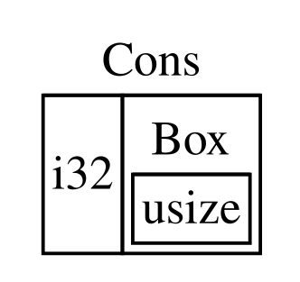

## Utilizzare `Box<T>` per Puntare ai Dati nell’Heap

Il puntatore intelligente più semplice è una _box_ (_scatola_), il cui _type_ è
scritto `Box<T>`. Le _box_ consentono di memorizzare i dati nell’_heap_ anziché
sullo _stack_. Ciò che rimane sullo _stack_ è il puntatore ai dati nell’_heap_.
Fai riferimento al [Capitolo 4][stack-heap] per rinfrescare la memoria sulla
differenza tra _stack_ e _heap_.

Le _box_ non hanno un _overhead_ di prestazioni, a parte il fatto che
memorizzano i dati nell’_heap_ anziché sullo _stack_. Ma non hanno nemmeno molte
funzionalità extra. Li userai più spesso in queste situazioni:

- Quando hai un _type_ la cui dimensione non può essere conosciuta in fase di
  compilazione e vuoi utilizzare un valore di quel _type_ in un contesto che
  richiede una dimensione esatta
- Quando hai una grande quantità di dati e vuoi trasferirne la _ownership_ ma
  vuoi evitare che i dati vengano copiati quando lo fai
- Quando vuoi possedere un valore e ti interessa solo che sia un _type_ con un
  determinato _trait_ piuttosto che essere di un _type_ specifico

Descriveremo la prima situazione in [“Abilitare i _Type_ Ricorsivi con le
_Box_”](#abilitare-i-type-ricorsivi-con-le-box)<!-- ignore -->. Nel secondo
caso, il trasferimento della _ownership_ di una grande quantità di dati può
richiedere molto tempo perché i dati vengono copiati sullo _stack_. Per
migliorare le prestazioni in questa situazione, possiamo memorizzare la grande
quantità di dati nell’_heap_ in una _box_. Quindi, solo la piccola quantità di
dati del puntatore viene copiata sullo _stack_, mentre i dati a cui fa
riferimento rimangono in un unico punto dell’_heap_. Il terzo caso è noto come
_oggetto_ _trait_ (_trait object_), e [una sezione][trait-objects]<!-- ignore
--> nel Capitolo 18 è dedicata specificamente a questo argomento. Quindi, ciò
che imparerai qui lo applicherai di nuovo in quella sezione!

### Memorizzare Dati nell’_Heap_

Prima di discutere il caso d’uso di archiviazione nell’_heap_ per `Box<T>`,
tratteremo la sintassi e come interagire con i valori memorizzati all’interno di
una `Box<T>`.

Il Listato 15-1 mostra come utilizzare una _box_ per memorizzare un valore `i32`
nell’_heap_.

<Listing number="15-1" file-name="src/main.rs" caption="Memorizzare un valore `i32` nell’_heap_ tramite una _box_">

```rust
{{#rustdoc_include ../listings/ch15-smart-pointers/listing-15-01/src/main.rs}}
```

</Listing>

Definiamo la variabile `b` come avente il valore di una `Box` che punta al
valore `5`, allocato nell’_heap_. Questo programma stamperà `b = 5`; in questo
caso, possiamo accedere ai dati nella _box_ in modo simile a come faremmo se
questi dati fossero sullo _stack_. Proprio come qualsiasi valore posseduto,
quando una _box_ esce dallo _scope_, come accade a `b` alla fine di `main`,
verrà de-allocata. La de-allocazione avviene sia per la _box_ (memorizzata sullo
_stack_) sia per i dati a cui punta (memorizzati nell’_heap_).

Mettere un singolo valore nell’_heap_ non è molto utile, quindi le _box_ non
verranno utilizzate molto spesso da sole in questo modo. Avere valori come un
singolo `i32` sullo _stack_, dove vengono memorizzati di default, è più
appropriato nella maggior parte delle situazioni. Diamo un’occhiata a un caso in
cui le _box_ ci consentono di definire _type_ che non saremmo autorizzati a
definire se non avessimo le _box_.

### Abilitare i _Type_ Ricorsivi con le _Box_

Un valore di un _type_ ricorsivo (_recursive type_) può avere un altro valore
dello stesso _type_ come parte di sé. I _type_ ricorsivi pongono un problema
perché Rust deve sapere in fase di compilazione quanto spazio occupa un certo
_type_. Tuttavia, l’annidamento dei valori dei _type_ ricorsivi potrebbe
teoricamente continuare all’infinito, quindi Rust non può sapere di quanto
spazio ha bisogno il valore. Poiché le _box_ hanno dimensioni note, possiamo
abilitare i _type_ ricorsivi inserendo una _box_ nella definizione del _type_
ricorsivo.

Come esempio di _type_ ricorsivo, esploriamo la _cons list_ (_lista di
costrutti_). Questo è un tipo di dato comunemente presente nei linguaggi di
programmazione funzionale. Il _type_ di _cons list_ che definiremo è semplice,
fatta eccezione per la ricorsione; pertanto, i concetti nell’esempio con cui
lavoreremo saranno utili ogni volta che ti troverai in situazioni più complesse
che coinvolgono i _type_ ricorsivi.

#### Comprendere la _Cons List_

Una _Cons List_ è una struttura dati derivata dal linguaggio di programmazione
Lisp e dai suoi dialetti, è composta da coppie annidate ed è la versione Lisp di
una lista concatenata. Il suo nome deriva dalla funzione `cons` (abbreviazione
di _construct function_) in Lisp, che costruisce una nuova coppia a partire dai
suoi due argomenti. Chiamando `cons` su una coppia composta da un valore e
un’altra coppia, possiamo costruire _cons list_ composte da coppie ricorsive.

Ad esempio, ecco una rappresentazione in pseudo-codice di una _cons list_
contenente la lista `1, 2, 3` con ciascuna coppia tra parentesi:

```text
(1, (2, (3, Nil)))
```

Ogni elemento in una _cons list_ contiene due elementi: il valore dell’elemento
corrente e l’elemento successivo. L’ultimo elemento della lista contiene solo un
valore chiamato `Nil` senza un elemento successivo. Una _cons list_ viene
prodotta chiamando ricorsivamente la funzione `cons`. Il nome canonico per
indicare il caso base della ricorsione è `Nil`. Nota che questo non è lo stesso
del concetto di “null” o “nil” discusso nel Capitolo 6, che indica un valore non
valido o assente.

La _cons list_ non è una struttura dati comunemente utilizzata in Rust. Nella
maggior parte dei casi quando si ha una lista di elementi in Rust, `Vec<T>` è
una scelta migliore. Altri tipi di dati ricorsivi più complessi _sono_ utili in
varie situazioni, ma iniziando con la _cons list_ in questo capitolo, possiamo
capire come le _box_ ci consentano di definire un tipo di dati ricorsivo senza
troppe distrazioni.

Il Listato 15-2 contiene una definizione _enum_ per una _cons list_. Nota che
questo codice non verrà ancora compilato perché il _type_ `Lista` non ha una
dimensione nota, che dimostreremo.

<Listing number="15-2" file-name="src/main.rs" caption="Il primo tentativo di definire una _enum_ per rappresentare una struttura dati di tipo _cons list_ di valori `i32`">

```rust,ignore,does_not_compile
{{#rustdoc_include ../listings/ch15-smart-pointers/listing-15-02/src/main.rs:here}}
```

</Listing>

> Nota: stiamo implementando una _cons list_ che contiene solo valori `i32` per
> gli scopi di questo esempio. Avremmo potuto implementarla utilizzando i
> generici, come discusso nel Capitolo 10, per definire un tipo di _cons list_
> in grado di memorizzare valori di qualsiasi _type_.

L’utilizzo del _type_ `Lista` per memorizzare l’elenco `1, 2, 3` sarebbe simile
al codice nel Listato 15-3.

<Listing number="15-3" file-name="src/main.rs" caption="Utilizzo dell’_enum_ `Lista` per memorizzare la lista `1, 2, 3`">

```rust,ignore,does_not_compile
{{#rustdoc_include ../listings/ch15-smart-pointers/listing-15-03/src/main.rs:here}}
```

</Listing>

Il primo valore `Cons` contiene `1` e un altro valore `Lista`. Questo valore
`Lista` è un altro valore `Cons` che contiene `2` e un altro valore `Lista`.
Questo valore `Lista` è un altro valore `Cons` che contiene `3` e un valore
`Lista`, che è infine `Nil`, la variante non ricorsiva che segnala la fine della
lista.

Se proviamo a compilare il codice nel Listato 15-3, otteniamo l’errore mostrato
nel Listato 15-4.

<Listing number="15-4" caption="L’errore che otteniamo quando si tenta di definire una _enum_ ricorsivo">

```console
{{#include ../listings/ch15-smart-pointers/listing-15-03/output.txt}}
```

</Listing>

L’errore indica che questo _type_ “ha dimensione infinita”. Il motivo è che
abbiamo definito `Lista` con una variante che è ricorsiva: contiene direttamente
un altro valore di se stessa. Di conseguenza, Rust non riesce a calcolare quanto
spazio è necessario per memorizzare un valore `Lista`. Analizziamo il motivo per
cui otteniamo questo errore. Innanzitutto, vedremo come Rust determina quanto
spazio è necessario per memorizzare un valore di un _type_ non ricorsivo.

#### Calcolare la Dimensione di un _Type_ Non Ricorsivo

Riprendiamo l’_enum_ `Messaggio` che abbiamo definito nel Listato 6-2 quando
abbiamo discusso le definizioni delle _enum_ nel Capitolo 6:

```rust
{{#rustdoc_include ../listings/ch06-enums-and-pattern-matching/listing-06-02/src/main.rs:here}}
```

Per determinare quanto spazio allocare per un valore `Messaggio`, Rust esamina
ciascuna delle varianti per vedere quale variante necessita di più spazio. Rust
vede che `Messaggio::Esci` non necessita di spazio, `Messaggio::Sposta`
necessita di spazio sufficiente per memorizzare due valori `i32` e così via.
Poiché verrà utilizzata una sola variante, lo spazio massimo di cui un valore
`Messaggio` avrà bisogno è lo spazio che richiederebbe per memorizzare la più
grande delle sue varianti.

Confrontiamo questo con ciò che accade quando Rust cerca di determinare di
quanto spazio necessita un _type_ ricorsivo come l’_enum_ `Lista` nel Listato
15-2. Il compilatore inizia esaminando la variante `Cons`, che contiene un
valore di _type_ `i32` e un valore di _type_ `Lista`. Pertanto, `Cons` necessita
di una quantità di spazio pari alla dimensione di un `i32` più la dimensione di
un `Lista`. Per calcolare la quantità di memoria necessaria per il _type_
`Lista`, il compilatore esamina le varianti, a partire dalla variante `Cons`. La
variante `Cons` contiene un valore di _type_ `i32` e un valore di _type_
`Lista`, e questo processo continua all’infinito, come mostrato nella Figura
15-1.


<span class="caption">Figura 15-1: Una `Lista` infinita composta da infinite varianti `Cons`</span>

#### Ottenere un _Type_ Ricorsivo con una Dimensione Nota

Poiché Rust non riesce a calcolare quanto spazio allocare per i _type_ definiti
ricorsivamente, il compilatore genera un errore con questo utile suggerimento:

<!-- manual-regeneration
after doing automatic regeneration, look at listings/ch15-smart-pointers/listing-15-03/output.txt and copy the relevant line
-->

```text
help: insert some indirection (e.g., a `Box`, `Rc`, or `&`) to break the cycle
  |
2 |     Cons(i32, Box<Lista>),
  |               ++++     +
```

In questo suggerimento, _indirection_ significa che invece di memorizzare un
valore direttamente, dovremmo modificare la struttura dati per memorizzarlo
indirettamente, memorizzando invece un puntatore al valore.

Poiché `Box<T>` è un puntatore, Rust sa sempre di quanto spazio una `Box<T>`
necessita: la dimensione di un puntatore non cambia in base alla quantità di
dati a cui punta. Questo significa che possiamo inserire `Box<T>` all’interno
della variante `Cons` invece di un altro valore `Lista` direttamente. `Box<T>`
punterà al successivo valore `Lista` che si troverà nell’_heap_ anziché
all’interno della variante `Cons`. Concettualmente, abbiamo ancora una lista,
creata con liste che contengono altre liste, ma questa implementazione ora è più
simile al posizionamento degli elementi uno accanto all’altro piuttosto che uno
dentro l’altro.

Possiamo modificare la definizione dell’_enum_ `Lista` nel Listato 15-2 e
l’utilizzo di `Lista` nel Listato 15-3 con il codice nel Listato 15-5, che verrà
compilato.

<Listing number="15-5" file-name="src/main.rs" caption="Definire `Lista` utilizzando `Box<T>` per avere una dimensione nota">

```rust
{{#rustdoc_include ../listings/ch15-smart-pointers/listing-15-05/src/main.rs}}
```

</Listing>

La variante `Cons` richiede la dimensione di un `i32` più lo spazio per
memorizzare i dati del puntatore della _box_. La variante `Nil` non memorizza
alcun valore, quindi necessita di meno spazio sullo _stack_ rispetto alla
variante `Cons`. Ora sappiamo che qualsiasi valore `Lista` occuperà le
dimensioni di un `i32` più le dimensioni dei dati del puntatore di una _box_.
Utilizzando una _box_, abbiamo interrotto la catena infinita e ricorsiva, in
modo che il compilatore possa calcolare la dimensione necessaria per memorizzare
un valore `Lista`. La Figura 15-2 mostra l’aspetto attuale della variante
`Cons`.



<span class="caption">Figura 15-2: Una `Lista` che non ha dimensioni infinite perché `Cons` contiene una `Box`</span>

Le _box_ forniscono solo l’indirezione e l’allocazione nell’_heap_; non hanno
altre funzionalità speciali, come quelle che vedremo con gli altri tipi di
puntatori intelligenti. Inoltre, non hanno alcun _overhead_ prestazionale che
queste funzionalità speciali comporterebbero, quindi possono essere utili in
casi come la _cons list_, in cui l’indirezione è l’unica funzionalità di cui
abbiamo bisogno. Esamineremo altri casi d’uso per le _box_ nel Capitolo 18.

Il _type_ `Box<T>` è un puntatore intelligente perché implementa il _trait_
`Deref`, che consente di trattare i valori `Box<T>` come _reference_. Quando un
valore `Box<T>` esce dallo _scope_, anche i dati dell’_heap_ a cui punta il
_box_ vengono de-allocati grazie all’implementazione del _trait_ `Drop`. Questi
due _trait_ saranno ancora più importanti per le funzionalità fornite dagli
altri tipi di puntatore intelligente che discuteremo nel resto di questo
capitolo. Vediamo  questi due _trait_ più in dettaglio.

[stack-heap]: ch04-01-what-is-ownership.html#lo-stack-e-lheap
[trait-objects]: ch18-02-trait-objects.html
