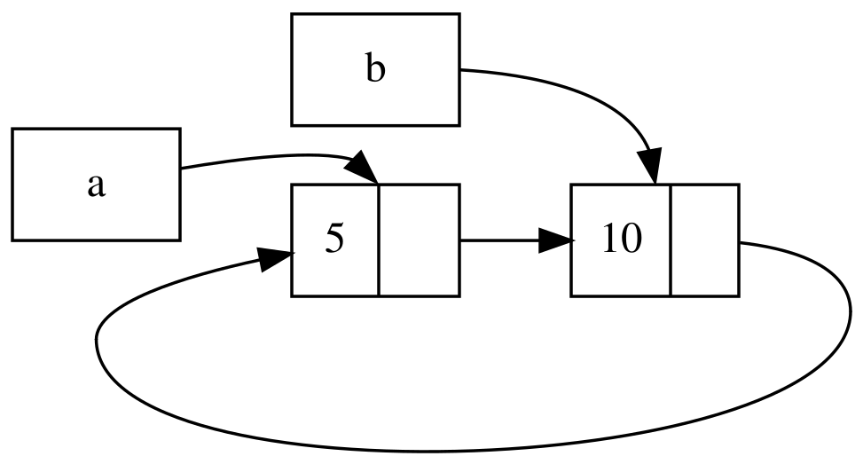

## Sequenze Auto-Referenziali Possono Causare Perdite di Memoria

Le garanzie di sicurezza della memoria di Rust rendono difficile, ma non
impossibile, creare accidentalmente memoria che non viene mai ripulita (noto
come _memory leak_, _perdita di memoria_). Prevenire completamente le perdite di
memoria non è una delle garanzie di Rust, il che significa che le perdite di
memoria sono sicure in Rust. Possiamo vedere che Rust consente perdite di
memoria utilizzando `Rc<T>` e `RefCell<T>`: è possibile creare _reference_ in
cui gli elementi si riferiscono l’uno all’altro in una sequenza. Questo crea
perdite di memoria perché il conteggio dei _reference_ di ciascun elemento nella
sequenza non raggiungerà mai 0 e i valori non verranno mai ripuliti.

### Creare una Sequenza Auto-Referenziale

Esaminiamo come potrebbe verificarsi una sequenza auto-referenziale e come
prevenirla, iniziando con la definizione dell’_enum_ `Lista` e di un metodo
`coda` nel Listato 15-25.

<Listing number="15-25" file-name="src/main.rs" caption="Una definizione di _cons list_ che contiene un `RefCell<T>` in modo da poter modificare a cosa fa riferimento una variante `Cons`">

```rust
{{#rustdoc_include ../listings/ch15-smart-pointers/listing-15-25/src/main.rs}}
```

</Listing>

Stiamo utilizzando un’altra variante della definizione `Lista` del Listato 15-5.
Il secondo elemento nella variante `Cons` è ora `RefCell<Rc<Lista>>`, il che
significa che invece di poter modificare il valore `i32` come abbiamo fatto nel
Listato 15-24, vogliamo modificare il valore `Lista` a cui punta una variante
`Cons`. Stiamo anche aggiungendo un metodo `coda` per facilitare l’accesso al
secondo elemento se abbiamo una variante `Cons`.

Nel Listato 15-26, stiamo aggiungendo una funzione `main` che utilizza le
definizioni nel Listato 15-25. Questo codice crea una lista in `a` e una lista
in `b` che punta alla lista in `a`. Quindi modifica la lista in `a` per puntare
a `b`, creando una sequenza auto-referenziale. Ci sono istruzioni `println!`
lungo il codice per mostrare quali sono i conteggi dei _reference_ in vari punti
di questo processo.

<Listing number="15-26" file-name="src/main.rs" caption="Creazione di una sequenza auto-referenziale di due valori `Lista` che puntano l’uno all’altro">

```rust
{{#rustdoc_include ../listings/ch15-smart-pointers/listing-15-26/src/main.rs:here}}
```

</Listing>

Creiamo un’istanza `Rc<Lista>` che contiene un valore `Lista` nella variabile
`a` con una lista iniziale di `5, Nil`. Creiamo quindi un’istanza `Rc<Lista>`
che contiene un altro valore `Lista` nella variabile `b` che contiene il valore
`10` e punta alla lista in `a`.

Modifichiamo `a` in modo che punti a `b` invece che a `Nil`, creando una
sequenza. Lo facciamo utilizzando il metodo `coda` per ottenere un _reference_ a
`RefCell<Rc<Lista>>` in `a`, che inseriamo nella variabile `link`. Quindi
utilizziamo il metodo `borrow_mut` su `RefCell<Rc<Lista>>` per modificare il
valore al suo interno da `Rc<Lista>` che contiene un valore `Nil` a `Rc<Lista>`
in `b`.

Quando eseguiamo questo codice, lasciando l’ultimo `println!` commentato per il
momento, otterremo questo output:

```console
{{#include ../listings/ch15-smart-pointers/listing-15-26/output.txt}}
```

Il conteggio dei _reference_ delle istanze di `Rc<Lista>` sia in `a` che in `b`
è 2 dopo aver modificato la lista in `a` in modo che punti a `b`. Alla fine di
`main`, Rust elimina la variabile `b`, che riduce il conteggio dei _reference_
dell’istanza `b` `Rc<Lista>` da 2 a 1. La memoria che `Rc<Lista>` ha nell’heap
non verrà rilasciata in questo punto perché il suo conteggio dei _reference_ è
1, non 0. Quindi Rust elimina `a`, che riduce anche il conteggio dei _reference_
dell’istanza `a` `Rc<Lista>` da 2 a 1. Anche la memoria di questa istanza non
può essere rilasciata, perché l’altra istanza `Rc<Lista>` fa ancora riferimento
ad essa. La memoria allocata alla lista rimarrà non utilizzata per sempre. Per
visualizzare questa sequenza auto-referenziale, abbiamo creato il diagramma in
Figura 15-4.



<span class="caption">Figura 15-4: Una sequenza auto-referenziale delle liste `a` e `b` che puntano l’una all’altra</span>

Se si rimuove il commento dall’ultimo `println!` e si esegue il programma, Rust
proverà a stampare questa sequenza con `a` che punta a `b` che punta a `a` e
così via fino a quando lo _stack_ non riempie completamente (_stack overflow_).

Rispetto a un programma reale, le conseguenze della creazione di una sequenza
auto-referenziale in questo esempio non sono poi così gravi: subito dopo aver
creato la sequenza auto-referenziale, il programma termina. Tuttavia, se un
programma più complesso allocasse molta memoria in una sequenza e la mantenesse
per un lungo periodo, utilizzerebbe più memoria del necessario e potrebbe
sovraccaricare il sistema, causando l’esaurimento della memoria disponibile.

Creare sequenze auto-referenziali non è facile, ma non è nemmeno impossibile. Se
si hanno valori `RefCell<T>` che contengono valori `Rc<T>` o simili combinazioni
annidate di _type_ con mutabilità interna e conteggio dei _reference_, è
necessario assicurarsi di non creare sequenze; non ci si può affidare a Rust per
individuarle. Creare una sequenza auto-referenziale rappresenterebbe un bug
logico nel programma che bisognerebbe minimizzare tramite test automatizzati,
revisioni del codice e altre pratiche di sviluppo software.

Un’altra soluzione per evitare le sequenze auto-referenziali è riorganizzare le
strutture dati in modo che alcuni _reference_ esprimano la _ownership_ e altri
no. Di conseguenza, si possono avere sequenze composte da alcune relazioni di
_ownership_ e alcune relazioni di non _ownership_, e solo le relazioni di
_ownership_ influiscono sulla possibilità o meno di eliminare un valore. Nel
Listato 15-25, vogliamo sempre che le varianti `Cons` posseggano la propria
lista, quindi riorganizzare la struttura dati non è possibile. Diamo un’occhiata
a un esempio che utilizza grafici composti da nodi genitore e nodi figlio per
vedere quando le relazioni di non _ownership_ sono un modo appropriato per
prevenire le sequenze auto-referenziali.

### Prevenire Sequenze Auto-Referenziali Usando `Weak<T>`

Finora, abbiamo dimostrato che la chiamata a `Rc::clone` aumenta lo
`strong_count` di un’istanza di `Rc<T>` e che un’istanza di `Rc<T>` viene
ripulita solo se il suo `strong_count` è 0. È anche possibile creare un
_reference_ _debole_ (_weak reference_) al valore all’interno di un’istanza di
`Rc<T>` chiamando `Rc::downgrade` e passando un _reference_ a `Rc<T>`. I
_reference_ _forti_ (_strong reference_) rappresentano il modo in cui è
possibile condividere la _ownership_ di un’istanza di `Rc<T>`. I _reference_
deboli non esprimono una relazione di _ownership_ e il loro conteggio non
influisce sulla pulizia di un’istanza di `Rc<T>`. Non causeranno una sequenza
auto-referenziale perché qualsiasi sequenza che coinvolga _reference_ deboli
verrà interrotta quando il conteggio dei valori coinvolti nei _reference_ forti
sarà pari a 0.

Quando si chiama `Rc::downgrade`, si ottiene un puntatore intelligente di _type_
`Weak<T>`. Invece di aumentare di 1 il valore `strong_count` nell’istanza di
`Rc<T>`, la chiamata `Rc::downgrade` aumenta di 1 il valore `weak_count`. Il
_type_ `Rc<T>` utilizza `weak_count` per tenere traccia del numero di
_reference_ `Weak<T>` esistenti, in modo simile a `strong_count`. La differenza
è che `weak_count` non deve essere 0 affinché l’istanza `Rc<T>` venga ripulita.

Poiché il valore a cui fa riferimento `Weak<T>` potrebbe essere stato eliminato,
per fare qualsiasi cosa con il valore a cui `Weak<T>` punta, è necessario
assicurarsi che il valore esista ancora. Per farlo, devi chiamare il metodo
`upgrade` su un’istanza `Weak<T>` che restituirà `Option<Rc<T>>`. Otterrai il
risultato `Some` se il valore `Rc<T>` non è stato ancora eliminato e il
risultato `None` se il valore `Rc<T>` è stato eliminato. Poiché `upgrade`
restituisce `Option<Rc<T>>`, Rust garantirà che i casi `Some` e `None` vengano
gestiti e che non ci saranno puntatori non validi.

Ad esempio, invece di utilizzare una lista i cui elementi conoscono solo
l’elemento successivo, creeremo un albero i cui elementi conoscono i loro
elementi figlio e il loro elemento genitore.

#### Creare una Struttura Dati ad Albero

Per iniziare, creeremo un albero con nodi che conoscono i loro nodi figlio.
Creeremo una _struct_ denominata `Nodo` che contiene il proprio valore `i32` e i
_reference_ ai valori dei suoi `Nodo` figli:

<span class="filename">File: src/main.rs</span>

```rust
{{#rustdoc_include ../listings/ch15-smart-pointers/listing-15-27/src/main.rs:here}}
```

Vogliamo che un `Nodo` possieda i suoi figli e vogliamo condividere tale
_ownership_ con le variabili in modo da poter accedere direttamente a ciascun
`Nodo` nell’albero. Per fare ciò, definiamo gli elementi `Vec<T>` come valori di
_type_ `Rc<Nodo>`. Vogliamo anche modificare quali nodi sono figli di un altro
nodo, quindi abbiamo una `RefCell<T>` in `figli` attorno a `Vec<Rc<Nodo>>`.

Successivamente, utilizzeremo la nostra _struct_ qui definita e creeremo
un’istanza `Nodo` denominata `foglia` con valore `3` e nessun elemento figlio, e
un’altra istanza denominata `ramo` con valore `5` e `foglia` come elemento
figlio, come mostrato nel Listato 15-27.

<Listing number="15-27" file-name="src/main.rs" caption="Creazione di un nodo `foglia` senza figli e di un nodo `ramo` con `foglia` come figlio">

```rust
{{#rustdoc_include ../listings/ch15-smart-pointers/listing-15-27/src/main.rs:there}}
```

</Listing>

Cloniamo `Rc<Nodo>` in `foglia` e lo memorizziamo in `ramo`, il che significa
che il `Nodo` in `foglia` ora ha due proprietari: `foglia` e `ramo`. Possiamo
passare da `ramo` a `foglia` tramite `ramo.figli`, ma non c’è modo di passare da
`foglia` a `ramo`. Il motivo è che `foglia` non ha alcun _reference_ a `ramo` e
non sa che sono correlati. Vogliamo che anche `foglia` sappia che `ramo` è il
suo genitore. Lo faremo ora.

#### Aggiungere un _Reference_ da un Nodo Figlio al Genitore

Per far sì che il nodo figlio riconosca il suo genitore, dobbiamo aggiungere un
campo `genitore` alla definizione della nostra _struct_ `Nodo`. Il problema sta
nel decidere quale tipo di `genitore` debba essere. Sappiamo che non può
contenere un `Rc<T>`, perché ciò creerebbe un sequenza auto-referenziale con
`foglia.genitore` che punta a `ramo` e `ramo.figlio` che punta a `foglia`, il
che farebbe sì che i loro valori `strong_count` non siano mai pari a 0.

Pensando alle relazioni in un altro modo, un nodo genitore dovrebbe possedere i
suoi figli: se un nodo genitore viene eliminato, anche i suoi nodi figli
dovrebbero essere eliminati. Tuttavia, un figlio non dovrebbe possedere il suo
genitore: se eliminiamo un nodo figlio, il genitore dovrebbe comunque esistere.
Questa è una situazione in cui i _reference_ deboli sono utili!

Quindi, invece di `Rc<T>`, faremo in modo che il _type_ di `genitore` sia
`Weak<T>`, in particolare `RefCell<Weak<Nodo>>`. Ora la definizione della
struttura `Nodo` appare così:

<span class="filename">File: src/main.rs</span>

```rust
{{#rustdoc_include ../listings/ch15-smart-pointers/listing-15-28/src/main.rs:here}}
```

Un nodo potrà fare riferimento al suo nodo genitore, ma non ne sarà il
proprietario. Nel Listato 15-28, aggiorniamo `main` per utilizzare questa nuova
definizione, in modo che il nodo `foglia` abbia un modo per fare riferimento al
suo genitore, `ramo`.

<Listing number="15-28" file-name="src/main.rs" caption="Un nodo `foglia` con un _reference_ debole al suo nodo genitore, `ramo`">

```rust
{{#rustdoc_include ../listings/ch15-smart-pointers/listing-15-28/src/main.rs:there}}
```

</Listing>

La creazione del nodo `foglia` è simile a quella del Listato 15-27, ad eccezione
del campo `genitore`: `foglia` inizia senza un genitore, quindi creiamo una
nuova istanza _reference_ vuota `Weak<Nodo>`.

A questo punto, quando proviamo a ottenere un _reference_ al genitore di
`foglia` utilizzando il metodo `upgrade`, otteniamo il valore `None`. Lo vediamo
nell’output della prima istruzione `println!`:

```text
genitore `foglia` = None
```

Quando creiamo il nodo `ramo`, avrà anche un nuovo _reference_ `Weak<Nodo>` nel
campo `genitore` perché `ramo` non ha un nodo genitore. Abbiamo ancora `foglia`
come uno dei figli di `ramo`. Una volta che abbiamo l’istanza `Nodo` in `ramo`,
possiamo modificare `foglia` per assegnargli un _reference_ `Weak<Nodo>` al suo
genitore. Utilizziamo il metodo `borrow_mut` su `RefCell<Weak<Nodo>>` nel campo
`genitore` di `foglia`, quindi utilizziamo la funzione `Rc::downgrade` per
creare un _reference_ `Weak<Nodo>` a `ramo` da `Rc<Nodo>` in `ramo`.

Quando stampiamo di nuovo il genitore di `foglia`, questa volta otterremo una
variante `Some` che contiene `ramo`: ora `foglia` può accedere al suo genitore!
Quando stampiamo `foglia`, evitiamo anche il ciclo che alla fine si è concluso
con uno stack overflow come nel Listato 15-26; i riferimenti `Weak<Nodo>`
vengono stampati come `(Weak)`:

```testo
genitore `foglia` = None
genitore `foglia` = Some(Nodo { valore: 5, genitore: RefCell { value: (Weak) }, figlio: RefCell { value: [Nodo { valore: 3, genitore: RefCell { value: (Weak) }, figlio: RefCell { value: [] } }] } })
```

L’assenza di output infinito indica che questo codice non ha creato una sequenza
auto-referenziale. Possiamo anche dedurlo osservando i valori ottenuti chiamando
`Rc::strong_count` e `Rc::weak_count`.

#### Visualizzare le Modifiche a `strong_count` e `weak_count`

Osserviamo come i valori di `strong_count` e `weak_count` delle istanze di
`Rc<Nodo>` cambiano creando un nuovo _scope_ interno e spostando la creazione di
`ramo` in tale _scope_. In questo modo, possiamo vedere cosa succede quando
`ramo` viene creato e poi eliminato quando esce dallo _scope_. Le modifiche sono
mostrate nel Listato 15-29.

<Listing number="15-29" file-name="src/main.rs" caption="Creazione di `ramo` in uno _scope_ interno ed esame dei conteggi dei _reference_ forti e deboli">

```rust
{{#rustdoc_include ../listings/ch15-smart-pointers/listing-15-29/src/main.rs:here}}
```

</Listing>

Dopo la creazione di `foglia`, il suo `Rc<Nodo>` ha un conteggio forte di 1 e un
conteggio debole di 0. Nello _scope_ interno, creiamo `ramo` e lo associamo a
`foglia`; a quel punto, quando stampiamo i conteggi, `Rc<Nodo>` in `ramo` avrà
un conteggio forte di 1 e un conteggio debole di 1 (per `foglia.genitore` che
punta a `ramo` con un `Weak<Nodo>`). Quando stampiamo i conteggi in `foglia`,
vedremo che avrà un conteggio forte di 2 perché `ramo` ora ha un clone di
`Rc<Nodo>` di `foglia` memorizzato in `ramo.figlio`, ma avrà ancora un conteggio
debole di 0.

Quando lo _scope_ interno termina, `ramo` esce dallo _scope_ e il conteggio
forte di `Rc<Nodo>` scende a 0, quindi il suo `Nodo` viene eliminato. Il
conteggio debole di 1 da `foglia.genitore` non ha alcuna influenza
sull’eliminazione o meno di `Nodo`, quindi non si verificano perdite di memoria!

Se proviamo ad accedere al genitore di `foglia` dopo la fine dello _scope_,
otterremo di nuovo `None`. Alla fine del programma, `Rc<Nodo>` in `foglia` ha un
conteggio forte di 1 e un conteggio debole di 0 perché la variabile `foglia` è
ora di nuovo l’unico _reference_ a `Rc<Nodo>`.

Tutta la logica che gestisce i conteggi e l’eliminazione dei valori è integrata
in `Rc<T>` e `Weak<T>` e nelle loro implementazioni del _trait_ `Drop`.
Specificando che la relazione tra un figlio e il suo genitore debba essere un
_reference_ `Weak<T>` nella definizione di `Nodo`, è possibile fare in modo che
i nodi genitore puntino ai nodi figlio e viceversa senza creare una sequenza
auto-referenziale e perdite di memoria.

## Riepilogo

Questo capitolo ha spiegato come utilizzare i puntatori intelligenti per
ottenere garanzie e compromessi diversi da quelli che Rust applica di default
con i normali _reference_. Il _type_ `Box<T>` ha una dimensione nota e punta ai
dati allocati nell’heap. Il _type_ `Rc<T>` tiene traccia del numero di
_reference_ ai dati nell’heap, in modo che i dati possano avere più proprietari.
Il _type_ `RefCell<T>` con la sua mutabilità interna ci fornisce un _type_ che
possiamo usare quando abbiamo bisogno di un _type_ immutabile ma con la
possibilità di modificare un valore interno di quel _type_; inoltre, applica le
regole di prestito in fase di esecuzione anziché in fase di compilazione.

Sono stati inoltre discussi i _trait_ `Deref` e `Drop`, che abilitano molte
delle funzionalità dei puntatori intelligenti. Abbiamo esplorato i sequenze
auto-referenziali che possono causare perdite di memoria e come prevenirle
utilizzando `Weak<T>`.

Se questo capitolo ha suscitato il tuo interesse e desideri implementare i tuoi
puntatori intelligenti, consulta [“The Rustonomicon”][nomicon] per ulteriori
informazioni utili.

In seguito, parleremo della concorrenza in Rust. Imparerai anche a conoscere
alcuni nuovi puntatori intelligenti.

[nomicon]: https://doc.rust-lang.org/stable/nomicon/index.html
