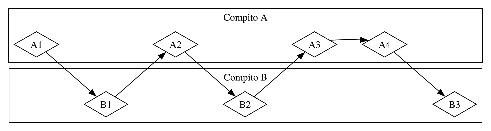
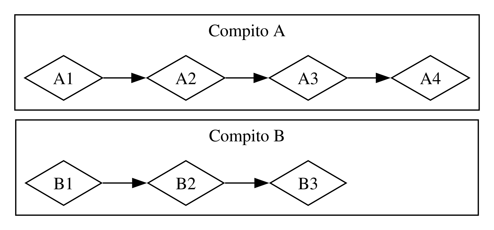
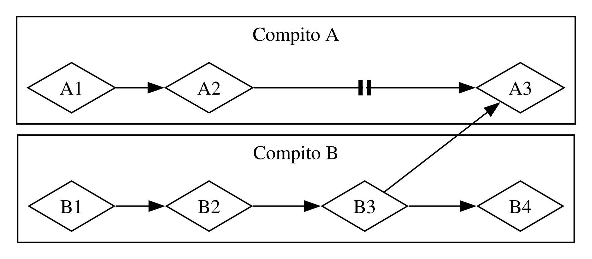

# Fondamenti di Programmazione Asincrona: _Async_, _Await_, _Future_ e _Stream_

Molte operazioni che chiediamo al computer di fare possono richiedere del tempo
per completarsi. Sarebbe bello poter fare altro mentre aspettiamo che questi
processi che richiedo molto tempo finiscano. I computer moderni offrono due
tecniche per lavorare su più operazioni contemporaneamente: parallelismo e
concorrenza. Tuttavia, non appena iniziamo a scrivere programmi che coinvolgono
operazioni parallele o concorrenti, ci imbattiamo rapidamente in nuove sfide
intrinseche alla _programmazione asincrona_, dove le operazioni potrebbero non
finire sequenzialmente nell’ordine in cui sono state avviate. Questo capitolo
espande quanto spiegato nel Capitolo 16 sull’uso dei _thread_ per parallelismo e
concorrenza, introducendo un approccio alternativo alla programmazione
asincrona: i _Future_ , gli _Stream_, la sintassi `async` e `await` che li
supporta, e gli strumenti per gestire e coordinare operazioni asincrone.

Consideriamo un esempio. Immagina di esportare un video che hai creato di una
celebrazione familiare, un’operazione che potrebbe durare da alcuni minuti a
ore. L’esportazione del video userà tutta la potenza disponibile di CPU e GPU.
Se avessi solo un core CPU e il tuo sistema operativo non mettesse in pausa
quell’esportazione fino al suo completamento - cioè, se la eseguisse
_sincronicamente_ - non potresti fare nient’altro sul tuo computer mentre quel
compito è in esecuzione. Sarebbe un’esperienza davvero frustrante.
Fortunatamente, il sistema operativo del tuo computer può, e lo fa, interrompere
invisibilmente l’esportazione abbastanza spesso da permetterti di fare altro
lavoro contemporaneamente.

Ora immagina di scaricare un video condiviso da qualcun altro, che può
richiedere del tempo ma non occupa altrettanta potenza CPU. In questo caso, la
CPU deve aspettare che i dati arrivino dalla rete. Puoi iniziare a leggere i
dati non appena iniziano ad arrivare, ma potrebbe volerci del tempo perché siano
completamente disponibili. Anche una volta che tutti i dati sono presenti, se il
video è molto grande, potrebbe volerci almeno un secondo o due per caricarlo
completamente. Potrebbe non sembrare molto, ma è un tempo lunghissimo per un
processore moderno, che può eseguire miliardi di operazioni ogni secondo. Ancora
una volta, il tuo sistema operativo interromperà invisibilmente il tuo programma
per permettere alla CPU di eseguire altro lavoro mentre aspetta che la chiamata
di rete finisca.

L’esportazione video è un esempio di operazione _vincolata dalla CPU_ o
_vincolata dal calcolo_. È limitata dalla velocità potenziale di elaborazione
dati all’interno della CPU o GPU e da quanto di quella velocità può dedicare
all’operazione. Il download video è un esempio di operazione _vincolata da I/O_,
perché è limitata dalla velocità di _input e output_ del computer; può andare
solo veloce quanto i dati possono essere inviati attraverso la rete.

In entrambi questi esempi, le invisibili interruzioni del sistema operativo
forniscono una forma di concorrenza. Quella concorrenza avviene solo al livello
dell’intero programma: il sistema operativo interrompe un programma per
permettere ad altri programmi di fare lavoro. In molti casi, poiché comprendiamo
i nostri programmi a un livello molto più granulare di quanto faccia il sistema
operativo, possiamo individuare opportunità di concorrenza che il sistema
operativo non vede.

Ad esempio, se stiamo costruendo uno strumento per gestire download di file,
dovremmo essere in grado di scrivere il nostro programma in modo che l’avvio di
un download non blocchi l’interfaccia utente, e gli utenti dovrebbero essere in
grado di avviare più download contemporaneamente. Molte API del sistema
operativo per interagire con la rete sono _bloccanti_; ovvero, bloccano il
progresso del programma finché i dati che stanno elaborando non sono
completamente pronti.

> Nota: È così che funzionano la _maggior parte_ delle chiamate di funzione, se
> ci pensi. Tuttavia, il termine _bloccante_ è solitamente riservato per
> chiamate di funzioni che interagiscono con file, rete o altre risorse del
> computer, perché questi sono i casi in cui un singolo programma trarrebbe
> beneficio se l’operazione fosse non-bloccante.

Potremmo evitare di bloccare il nostro _thread_ principale creando un _thread_
dedicato per scaricare ogni file. Tuttavia, l’_overhead_ di questi _thread_
diventerebbe presto un problema. Sarebbe preferibile se la chiamata non
bloccasse fin dall’inizio. Sarebbe anche meglio se potessimo scrivere nello
stesso stile diretto che usiamo nel codice bloccante, qualcosa di simile a:

```rust,ignore,does_not_compile
let dati = ricevi_dati_da(url).await;
println!("{dati}");
```

Proprio questo è ciò che l’astrazione _async_ di Rust ci offre. In questo
capitolo, imparerai tutto su _async_ mentre affronteremo i seguenti argomenti:

- Come usare la sintassi `async` e `await` di Rust
- Come usare il modello _async_ per risolvere alcune delle sfide che abbiamo
  esaminato nel Capitolo 16
- Come _multi-threading_ e _async_ forniscono soluzioni complementari, che in
  molti casi puoi combinare

Prima di vedere come _async_ funziona nella pratica, però, dobbiamo fare una
breve deviazione per discutere le differenze tra parallelismo e concorrenza.

### Parallelismo e Concorrenza

Finora abbiamo trattato parallelismo e concorrenza come quasi intercambiabili.
Ora dobbiamo distinguerli più precisamente, perché le differenze emergeranno man
mano che inizieremo a lavorarci.

Considera i diversi modi in cui un team potrebbe dividere il lavoro in un
progetto software. Potresti assegnare a un singolo membro più compiti, assegnare
a ciascun membro un compito, o usare un mix dei due approcci.

Quando un individuo lavora su diversi compiti prima che uno di essi sia
completato, questo è _concorrenza_. Magari hai due progetti diversi aperti sul
tuo computer, e quando ti annoi o ti blocchi su un progetto, passi all’altro.
Sei una sola persona, quindi non puoi fare progressi su entrambi i compiti
esattamente nello stesso momento, ma puoi fare multi-tasking, facendo progressi
su uno alla volta passando dall’uno all’altro (vedi Figura 17-1).



<span class="caption">Figura 17-1: Un flusso di lavoro concorrente, passando tra
Compito A e Compito B</span>

Quando il team divide un insieme di compiti facendo sì che ogni membro prenda un
compito e lo porti avanti da solo, questo è _parallelismo_. Ogni persona del
team può fare progressi esattamente nello stesso momento (vedi Figura 17-2).



<span class="caption">Figura 17-2: Un flusso di lavoro parallelo, dove il lavoro
avviene sui Compiti A e B indipendentemente</span>

In entrambi questi flussi di lavoro, potresti dover coordinare tra diversi
compiti. Forse _pensavi_ che il compito assegnato a una persona fosse totalmente
indipendente dal lavoro di tutti gli altri, ma in realtà richiede che un’altra
persona del team completi prima il proprio compito. Parte del lavoro potrebbe
essere eseguita in parallelo, ma parte di esso sarebbe effettivamente _seriale_:
potrebbe avvenire solo in serie, un compito dopo l’altro, come nella Figura
17-3.



<span class="caption">Figura 17-3: Un flusso di lavoro parzialmente parallelo,
dove il lavoro sui Compiti A e B procede indipendentemente finché A3 non è
bloccato aspettando i risultati di B3.</span>

Allo stesso modo, potresti renderti conto che uno dei tuoi compiti dipende da un
altro dei tuoi compiti. Ora il tuo lavoro concorrente è diventato seriale.

Parallelismo e concorrenza possono anche intersecarsi tra loro. Se scopri che un
collega è bloccato finché non completi uno dei tuoi compiti, probabilmente
concentrerai tutti i tuoi sforzi su quel compito per "sbloccare" il tuo collega.
Tu e il tuo collega non siete più in grado di lavorare in parallelo, e non siete
nemmeno più in grado di lavorare concorrentemente sui vostri compiti.

Le stesse dinamiche di base si applicano al software e all’hardware. Su una
macchina con un singolo core CPU, la CPU può eseguire solo un’operazione alla
volta, ma può comunque lavorare concorrentemente. Utilizzando strumenti come
_thread_, processi e _async_, il computer può mettere in pausa un’attività e
passare ad altre prima di tornare eventualmente a quella prima attività. Su una
macchina con più core CPU, può anche eseguire lavoro in parallelo. Un core può
eseguire un compito mentre un altro core esegue un compito completamente
indipendente, e quelle operazioni accadono effettivamente nello stesso momento.

Quando si lavora con _async_ in Rust, stiamo sempre trattando con la
concorrenza. A seconda dell’hardware, del sistema operativo e del _runtime_
_async_ che stiamo utilizzando (parleremo presto dei _runtime_ _async_), quella
concorrenza potrebbe anche star utilizzando in realtà il parallelismo.

Ora, immergiamoci in come funziona effettivamente la programmazione asincrona in
Rust.
