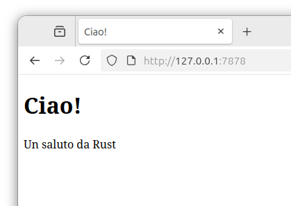

# Progetto Finale: Costruire un Server Web Multi-_Thread_

È stato un lungo viaggio, ma siamo arrivati alla fine del libro. In questo
capitolo, realizzeremo insieme un ultimo progetto per dimostrare alcuni dei
concetti trattati negli ultimi capitoli, oltre a ripassare alcune lezioni
precedenti.

Per il nostro progetto finale, realizzeremo un server web che dice “ciao” e
appare come nella Figura 21-1 in un browser web.

Ecco il nostro piano per la costruzione del server web:

1. Imparare un po’ su TCP e HTTP.
1. Ascoltare le connessioni TCP su un socket.
1. Analizzare un numero limitato di richieste HTTP.
1. Creare una risposta HTTP appropriata.
1. Migliorare le prestazioni del server implementando un _pool_ di _thread_.

Figura 21-1: Il nostro progetto finale condiviso

Prima di iniziare, dovremmo menzionare due dettagli. Primo, il metodo che
useremo non sarà il modo migliore per costruire un server web con Rust. I membri
della community hanno pubblicato un numero di _crate_ pronti per la produzione
disponibili su [crates.io](https://crates.io/) che forniscono implementazioni
più complete di server web e pool di _thread_ rispetto a quelle che costruiremo.
Tuttavia, la nostra intenzione in questo capitolo è aiutarti a imparare, non
prendere la strada facile. Poiché Rust è un linguaggio di programmazione di
sistema, possiamo scegliere il livello di astrazione con cui lavorare e possiamo
scendere a un livello inferiore rispetto a quanto sia possibile o pratico in
altri linguaggi.

Secondo, non useremo _async_ e _await_ qui. Costruire un _pool_ di _thread_ è
già una sfida abbastanza grande da sola, senza aggiungere la costruzione di un
runtime _async_! Tuttavia, noteremo come _async_ e _await_ potrebbero essere
applicabili ad alcuni dei stessi problemi che vedremo in questo capitolo. In
definitiva, come abbiamo notato nel Capitolo 17, molti runtime _async_ usano
_pool_ di _thread_ per gestire il loro lavoro.

Scriveremo quindi il server HTTP di base e il _pool_ di _thread_ manualmente in
modo che tu possa imparare le idee e le tecniche generali dietro i _crate_ che
potresti usare in futuro.
